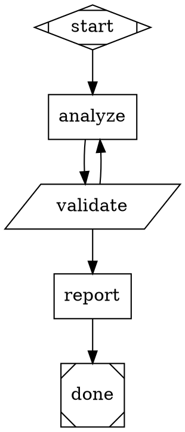
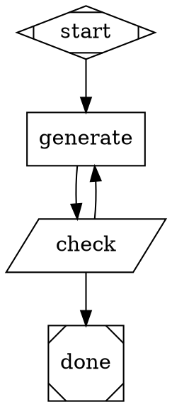

# Pipeline Design Principles

Design guidance for attractor pipeline authors. These principles describe when and why
to make structural decisions. For implementation patterns and DOT skeletons, see
[`docs/PIPELINE_PATTERNS.md`](PIPELINE_PATTERNS.md).

**Scope.** The execution engine runs whatever graph it is given; it does not enforce
these principles. Tier selection, loop structure, validation strategy, parameterization,
and verdict design are entirely the pipeline author's choices. These principles articulate
the trade-offs so those choices are deliberate.

---

## 1. Tier Discipline: Code-Tier vs LLM-Tier Nodes

> Use code-tier nodes for what code does reliably. Use LLM-tier nodes for what code
> does poorly. The mistake runs in both directions.

**Code-tier nodes** (`shape=parallelogram`) are appropriate for: deterministic
transformations, format conversion, schema validation, numeric thresholds, exit-code
routing, file presence checks, fan-in/fan-out coordination, and any task `grep`, `jq`,
or `bash` can perform reliably.

**LLM-tier nodes** (`shape=box`) are appropriate for: generation, analysis, judgment,
planning, summarization, synthesis, and classification under ambiguity — tasks where
the answer is not fully determined by the input.

The mistake in each direction:

- **LLM-tier where code suffices.** Slower, more expensive, introduces output variance
  where there should be none. Any deterministic task done by an LLM-tier node is a
  reliability liability.
- **Code-tier where judgment is needed.** Brittle; fails silently on edge cases not
  anticipated at design time. Validation logic written as code cannot handle ambiguity
  or interpret unstructured input.

Self-test: **"Is the model here for judgment, or just to type?"** If "just to type,"
the node should be `shape=parallelogram`.



`validate` is deterministic — parallelogram, not box. `analyze` and `report` require
judgment — box, not parallelogram. The routing signal comes from `printf`, not from LLM
output.

For implementation patterns and anti-pattern catalog, see
[`docs/PIPELINE_PATTERNS.md`](PIPELINE_PATTERNS.md).

---

## 2. Validation Node Patterns

> Validation nodes should be deterministic when criteria are stable; LLM-judgment-bearing
> when criteria require interpretation.

**Use code-tier validation when criteria are unambiguous:** schema conformance, syntax
checks, format constraints, numeric thresholds, file presence, exit codes. These checks
are fast, free from variance, and produce exact error messages suitable for retry loops.

**Use LLM-tier validation when criteria require interpretation:** semantic equivalence,
coherence assessment, quality judgments, "does this satisfy the goal." These checks cannot
be expressed as deterministic predicates.

**Composite pattern: cheap first, expensive second.**

```dot
StructuralCheck [
    shape=parallelogram,
    tool_command="python check_schema.py && printf pass || printf fail"
];
QualityReview [
    shape=box,
    prompt="Review this output. Does it satisfy $goal? Write your verdict to verdict.txt."
];

GenerationNode -> StructuralCheck;
StructuralCheck -> QualityReview [condition="context.tool.last_line=pass"];
StructuralCheck -> GenerationNode [condition="context.tool.last_line=fail"];
```

Do not pay for LLM judgment on outputs that fail trivial structural checks. The
code-tier check eliminates structurally invalid outputs before they reach the LLM-tier
check. Both nodes can route: the structural check routes back to the generator on format
failure; the quality check routes forward or back on judgment.

---

## 3. Loop Convergence Patterns

> Loops require a deterministic exit predicate, a bounded iteration count, or both.
> LLM-judged convergence without a hard upper bound may never terminate.

**Pattern A — Deterministic exit.** A code-tier predicate signals stop. The exit
condition is a deterministic function of observable state — no LLM decides when to stop.

```dot
Iterate [shape=box, prompt="Advance the work described in $goal"]
Check   [shape=parallelogram,
         tool_command="python check_done.py && printf done || printf continue"]

Iterate -> Check;
Check   -> Iterate [condition="context.tool.last_line=continue"];
Check   -> Done    [condition="context.tool.last_line=done"];
```

**Pattern B — Bounded iteration.** `max_retries` enforces a hard cap regardless of
node behavior.

```dot
graph [default_max_retry=4]

Iterate [shape=box, goal_gate=true, retry_target=Iterate,
         prompt="Attempt to complete $goal. Signal success when done."]
```

Up to 5 total executions (1 initial + 4 retries). When retries are exhausted, the engine
follows `retry_target` or `fallback_retry_target` per the retry contract. See
[`examples/pipelines/04-retry-with-fallback.dot`](../examples/pipelines/04-retry-with-fallback.dot).

**Pattern C — Composite (soft + hard).** An LLM-tier node judges convergence; a `max_retries`
cap guarantees termination. The LLM is never the sole stop condition.

When using LLM judgment as the convergence signal in Pattern C, apply the file-based routing
discipline from [`docs/PIPELINE_PATTERNS.md §AP-2`](PIPELINE_PATTERNS.md): have the LLM write
its verdict to a file; a parallelogram node greps the file and emits the routing sentinel via
`printf`. Do not route directly on LLM token output.

**When Pattern A is preferable to Pattern B.** If the terminal state is directly observable
in the environment (file exists, test passes, count reaches threshold), Pattern A is more
robust — the exit is determined by evidence, not by run count. Pattern B is appropriate when
the only terminal signal is the LLM reporting completion.

---

## 4. LLM Output Protocol Patterns

> When an LLM-tier node must produce output in a specific format, choose one of three
> strategies deliberately. The default — demand the format, hope for compliance — is
> not a strategy.

**Strategy SF — Skip the Format.**
The format is only needed to feed the next code step. The real goal is an effect: file
edits, state changes, data mutations. Have the LLM do the work directly with its file
tools; let downstream code observe the result via exit codes, file presence, or tool
output (`git diff`, `wc -l`, validator return codes).

Applicable when: unified diffs, config mutations, any transformation where the effect
is the deliverable, not the format describing it.

**Strategy MLE — Make the Format LLM-Easy.**
Redesign the output protocol to match what LLMs do reliably: single keywords, simple
prose with anchored markers, minimal JSON with few required fields. Reduce precision
requirements to reduce variance. Use `grep -qi` (keyword match) rather than exact
string comparison.

Applicable when: routing sentinels, status indicators, binary or small-enumeration
classification. Format simplification eliminates the variance, not the format itself.

**Strategy V+R — Validate and Retry.**
A code-tier node immediately following the LLM-tier node validates the output format.
On failure, route back to the LLM with the exact validation error as context.
Self-corrects in one or two iterations because the feedback is precise.

Applicable when: the structured format IS the deliverable — consumed by humans, stored
as a project artifact, or carrying semantic value that cannot be replaced by a direct
file edit.

**Choosing between strategies:**

| Question | Strategy |
|---|---|
| Is the format only needed by the next code step? | SF |
| Can the format be simplified to reduce variance? | MLE |
| Is the format the final deliverable, and simplification would lose value? | V+R |

For DOT skeletons for each strategy, see [`docs/PIPELINE_PATTERNS.md`](PIPELINE_PATTERNS.md).

---

## 5. Top-Level Pipeline Parameterization

> Surface operator-useful knobs as top-level pipeline parameters with sensible defaults.
> Defaults should match the most common operator intent.

Attractor graphs support `$param` expansion and the `graph [params="..."]` attribute.
When a design choice — iteration count, quality threshold, verbosity mode, model selection —
is likely to vary across runs or operators, make it a parameter rather than a hardcoded
value. This allows experimentation and tuning without forking the pipeline.

**What to surface as parameters:**

- Iteration counts and retry ceilings (`default_max_retry`, per-node `max_retries`)
- Sample sizes or batch limits for pipelines that process sets of items
- Quality thresholds for verdict or gate nodes
- Model selection per node class when the pipeline is intended to run across providers
  (`llm_model` via `model_stylesheet` selectors)
- Mode flags: debug/normal, strict/lenient, verbose/quiet

**Default discipline.** A parameter with no default forces configuration on every run —
treat that as a design defect unless the parameter has no sensible default. Operators
should be able to run the pipeline unchanged and get a correct result.



Operators pass `max_rounds` and `quality_threshold` to tune behavior; the pipeline
handles the common case without them via `default_max_retry`.

---

## 6. Trusting Verdict-Bearing Nodes

> When a pipeline node produces a verdict — PASS/FAIL, HIGH/LOW confidence,
> approved/rejected — respect the conservatism it signals. LOW-CONFIDENCE usually
> means LOW-DATA, not LOW-EFFECT.

Pipelines with explicit verdict layers encode structural conservatism: the node reports
LOW-CONFIDENCE when the evidence available to it was insufficient for a confident
conclusion. This does not mean the measured effect is absent or small. It means the
data was thin.

**The instinct on LOW-CONFIDENCE:** run more iterations. This is sometimes right. It is
often not the cheapest first move.

**The better first step:** examine the structural evidence beneath the verdict. Was the
variance across runs from noise (same execution path, different outputs) or from the
pipeline taking different branches across runs? Different branches mean different code
paths were exercised — and the sample is effectively a mixture of two populations, not
one noisy population. Structural evidence (which branches fired, which nodes were
reached, which tools were called) often resolves the verdict at the existing sample size
by identifying which population the outlier belonged to.

**Design consequence for verdict-bearing nodes:**

- Emit enough intermediate state that post-run evidence review is possible. A verdict
  node that produces only PASS/FAIL without the evidence it evaluated forecloses this.
- Write intermediate findings to files or pipeline context so they are inspectable after
  the run completes.
- Distinguish "confident FAIL" (evidence supports failure) from "insufficient evidence"
  (could not determine). If the node conflates them, operators will always escalate run
  count rather than examining the available data.

**Anti-pattern:** scaling up iteration count without first determining whether variance
is structural (different execution paths) or stochastic (same path with noise). Structural
variance is resolved by understanding which branch fired; stochastic variance is resolved
by adding runs. Conflating them wastes iterations on a question evidence already answers.

---

## Cross-References

| Topic | Where to look |
|---|---|
| Implementation patterns for LLM/code-tier nodes, SF/V+R/anti-patterns | [`docs/PIPELINE_PATTERNS.md`](PIPELINE_PATTERNS.md) |
| Node shapes, handler attributes, edge conditions | [`docs/DOT-AUTHORING-GUIDE.md`](DOT-AUTHORING-GUIDE.md), [`docs/DOT-SYNTAX.md`](DOT-SYNTAX.md) |
| Conditional routing edge selection algorithm | [`docs/ROUTING-REFERENCE.md`](ROUTING-REFERENCE.md) |
| Retry-with-fallback and convergence example | [`examples/pipelines/04-retry-with-fallback.dot`](../examples/pipelines/04-retry-with-fallback.dot) |
| Engine-level contracts (M5 substitution, fail-fast, structural concurrency) | [`docs/CONTRACTS.md`](CONTRACTS.md) |
