# UX Polish Design: Bug Fixes, Generative Pipeline, Practical Pipelines, Docs

> **Status**: Design  
> **Date**: 2026-02-14  
> **Scope**: 3 batches — bug fixes, generative pipeline + practical pipelines, documentation + $param expansion

---

## Table of Contents

1. [Batch 1: Bug Fixes](#batch-1-bug-fixes)
   - [Bug 1: "No Output" from pipeline](#bug-1-no-output-from-pipeline)
   - [Bug 2: LLM calls `wait` after pipeline](#bug-2-llm-calls-wait-after-pipeline)
2. [Batch 2: Generative Pipeline + Practical Pipelines](#batch-2-generative-pipeline--practical-pipelines)
   - [Generative Pipeline Pattern](#generative-pipeline-pattern)
   - [Full `context/dot-reference.md` Content](#full-contextdot-referencemd-content)
   - [Practical Pipelines (5)](#practical-pipelines)
3. [Batch 3: Documentation + $param Expansion](#batch-3-documentation--param-expansion)
   - [README Rewrite](#readme-rewrite)
   - [DOT Syntax Cheat Sheet](#dot-syntax-cheat-sheet)
   - [$param Template Expansion](#param-template-expansion)
4. [Effort Estimates](#effort-estimates)

---

## Batch 1: Bug Fixes

### Bug 1: "No Output" from pipeline

#### Root Cause Analysis

The bug involves three files in a chain:

**1. Engine returns last node's outcome — `engine.py:488-527`**

When the pipeline reaches the exit node (Msquare, line 141), `_check_goal_gates()` is called (line 150). If all gates are satisfied (line 520-527), it returns the *last completed node's outcome*:

```python
# engine.py:522-527
if self.completed_nodes:
    last_id = self.completed_nodes[-1]
    last_outcome = self.node_outcomes.get(last_id)
    if last_outcome:
        return last_outcome
return Outcome(status=StageStatus.SUCCESS, notes="Pipeline completed")
```

The problem: `last_outcome` is whatever the final *executed* node produced. If that node's LLM response was parsed by `_parse_outcome()` (in `backend.py`) and the response didn't contain a recognizable status structure, the `notes` field may be `None` or a truncated snippet via `context_updates["last_response"]` (line 149 of `__init__.py`).

**2. Orchestrator passes raw outcome — `__init__.py:376-384`**

The `execute()` method builds the JSON result directly from the engine outcome:

```python
# __init__.py:376-384
outcome = await engine.run(goal=prompt or None)
result = {
    "status": outcome.status.value,
    "notes": outcome.notes,          # <-- Can be None
    "failure_reason": outcome.failure_reason,
}
return json.dumps(result)
```

When `outcome.notes` is `None`, the JSON contains `"notes": null`.

**3. Tool surfaces "No output" — `tool-pipeline-run/__init__.py:453-467`**

The tool parses the JSON and falls through to the empty-notes path:

```python
# tool-pipeline-run/__init__.py:456-467
if isinstance(output, str) and output.strip().startswith("{"):
    try:
        parsed = json.loads(output)
        pipeline_status = parsed.get("status", "success")
        pipeline_notes = parsed.get("notes", "")    # <-- gets None from JSON null
    except (json.JSONDecodeError, AttributeError):
        pipeline_notes = output[:500] if output else "Pipeline completed"
else:
    pipeline_notes = output[:500] if output else "Pipeline completed"
```

When `pipeline_notes` is `None` (from `json.loads` returning Python `None` for JSON `null`), it gets passed to the ToolResult as `None`. The LLM sees no meaningful content and reports "No output."

#### Fix Design

**Fix A — Orchestrator builds a meaningful summary (`__init__.py`)**

Replace lines 376-384 with a summary builder that aggregates all node outcomes when the final outcome's notes are sparse:

```python
# __init__.py — replace lines 376-384

outcome = await engine.run(goal=prompt or None)

# Build a meaningful summary from all completed nodes
summary = self._build_pipeline_summary(engine, outcome)

result = {
    "status": outcome.status.value,
    "notes": summary,
    "failure_reason": outcome.failure_reason,
    "nodes_completed": len(engine.completed_nodes),
    "node_statuses": {
        nid: engine.node_outcomes[nid].status.value
        for nid in engine.completed_nodes
        if nid in engine.node_outcomes
    },
}
return json.dumps(result)
```

Add the `_build_pipeline_summary` method to `PipelineOrchestrator`:

```python
def _build_pipeline_summary(self, engine: PipelineEngine, outcome: Outcome) -> str:
    """Build a human-readable pipeline summary.

    If the final outcome has meaningful notes, use them.
    Otherwise, synthesize a summary from all completed nodes.
    """
    # Use the outcome's notes if they exist and are meaningful
    if outcome.notes and len(outcome.notes) > 20:
        return outcome.notes

    # Synthesize from all node outcomes
    parts = []
    total = len(engine.completed_nodes)
    succeeded = sum(
        1 for nid in engine.completed_nodes
        if nid in engine.node_outcomes
        and engine.node_outcomes[nid].is_success
    )
    failed = total - succeeded

    parts.append(f"Pipeline completed: {succeeded}/{total} nodes succeeded.")

    if failed:
        failed_nodes = [
            nid for nid in engine.completed_nodes
            if nid in engine.node_outcomes
            and not engine.node_outcomes[nid].is_success
        ]
        parts.append(f"Failed nodes: {', '.join(failed_nodes)}.")

    # Include the last node's notes if available
    if engine.completed_nodes:
        last_id = engine.completed_nodes[-1]
        last_out = engine.node_outcomes.get(last_id)
        if last_out and last_out.notes:
            # Truncate to avoid bloating the summary
            snippet = last_out.notes[:300]
            parts.append(f"Last node ({last_id}): {snippet}")

    return " ".join(parts)
```

**Fix B — Tool-pipeline-run also synthesizes when sparse (`tool-pipeline-run/__init__.py`)**

Replace the result parsing block (lines 453-491) to handle null/empty notes and include richer structured output:

```python
# tool-pipeline-run/__init__.py — replace lines 453-491

# Try to parse structured outcome from pipeline output
pipeline_status = "success"
pipeline_notes = ""
nodes_completed = 0
node_statuses = {}

if isinstance(output, str) and output.strip().startswith("{"):
    try:
        parsed = json.loads(output)
        pipeline_status = parsed.get("status", "success")
        pipeline_notes = parsed.get("notes") or ""
        nodes_completed = parsed.get("nodes_completed", 0)
        node_statuses = parsed.get("node_statuses", {})
    except (json.JSONDecodeError, AttributeError):
        pipeline_notes = output[:500] if output else ""
else:
    pipeline_notes = output[:500] if output else ""

# Synthesize a summary if notes are still empty
if not pipeline_notes.strip():
    summary_parts = [f"Pipeline finished with status: {pipeline_status}."]
    if nodes_completed:
        summary_parts.append(f"{nodes_completed} nodes executed.")
    if node_statuses:
        summary_parts.append(
            "Node results: " +
            ", ".join(f"{k}={v}" for k, v in node_statuses.items())
        )
    pipeline_notes = " ".join(summary_parts)

# ... (progress and emit_event unchanged) ...

return ToolResult(
    success=True,
    output={
        "status": pipeline_status,
        "session_id": session_id,
        "notes": pipeline_notes,
        "duration_seconds": duration,
        "runner_agent": runner_agent,
        "message": (
            "Pipeline execution complete. The pipeline has finished "
            "synchronously — no further action is needed for this pipeline."
        ),
    },
)
```

**Files to change:**
| File | Location | Change |
|------|----------|--------|
| `modules/loop-pipeline/amplifier_module_loop_pipeline/__init__.py` | Lines 376-384 | Build structured result with summary |
| `modules/loop-pipeline/amplifier_module_loop_pipeline/__init__.py` | New method after line 399 | Add `_build_pipeline_summary()` |
| `modules/tool-pipeline-run/amplifier_module_tool_pipeline_run/__init__.py` | Lines 453-491 | Handle null notes, synthesize summary |

---

### Bug 2: LLM calls `wait` after pipeline

#### Root Cause Analysis

The LLM receives a ToolResult (line 483-491 of `tool-pipeline-run/__init__.py`) that contains only data fields (`status`, `session_id`, `notes`, etc.) but no explicit instruction telling the LLM that the pipeline is done. The LLM — trained on async patterns — assumes it needs to poll for completion and calls `wait`, `close_agent`, or `send_input`.

The current `pipeline-awareness.md` (45 lines) describes *how* to call `run_pipeline` but says nothing about what happens *after* it returns.

#### Fix Design

**Fix A — Update `context/pipeline-awareness.md`**

Rewrite the file to be explicit about post-pipeline behavior:

```markdown
# Pipeline Capabilities

You have access to the `run_pipeline` tool which can execute DOT graph pipelines.

## Critical: run_pipeline is SYNCHRONOUS

`run_pipeline` is a **synchronous** tool. When it returns, the pipeline is **fully
complete**. Do NOT call any of these after a pipeline run:
- `wait` — the pipeline is already done
- `close_agent` — the pipeline session is already closed
- `send_input` — there is no pending pipeline to send input to
- Any polling or status-check tool

When `run_pipeline` returns its result, simply read the result and respond to the
user with a summary of what the pipeline accomplished.

## When to Use Pipelines

Use `run_pipeline` when the user asks you to:
- Run a pipeline or workflow defined in a `.dot` file
- Execute a multi-step coding pipeline
- Run an Attractor pipeline

For simple tasks (1-2 straightforward steps), just do the work directly — no
pipeline needed.

## How to Use

Call `run_pipeline` with:
- **`goal`** (required): The task description. This replaces `$goal` in node prompts.
- **`dot_file`** (optional): Path to a `.dot` file. Supports `@attractor:` mentions.
- **`dot_source`** (optional): Inline DOT digraph string.
- **`params`** (optional): Key-value pairs for `$param` expansion in node prompts.

You must provide either `dot_file` or `dot_source`.

## Examples

Run a pipeline from a file:
```json
{
  "goal": "Refactor the authentication module to use async patterns",
  "dot_file": "@attractor:examples/pipelines/02-plan-implement-test.dot"
}
```

Run a simple inline pipeline:
```json
{
  "goal": "Add input validation to the user registration endpoint",
  "dot_source": "digraph { start [shape=Mdiamond]; implement [prompt=\"$goal\"]; test [prompt=\"Write tests for the changes\"]; done [shape=Msquare]; start -> implement -> test -> done }"
}
```

## Available Example Pipelines

- `@attractor:examples/pipelines/01-simple-linear.dot` — Minimal start -> implement -> done
- `@attractor:examples/pipelines/02-plan-implement-test.dot` — Plan, implement, test cycle
- `@attractor:examples/pipelines/03-conditional-routing.dot` — Conditional branching based on outcomes
- `@attractor:examples/pipelines/04-retry-with-fallback.dot` — Retry logic with fallback paths
- `@attractor:examples/pipelines/05-parallel-fan-out.dot` — Parallel execution with fan-in
- `@attractor:examples/pipelines/06-model-stylesheet.dot` — Multi-provider model selection

## After a Pipeline Completes

When `run_pipeline` returns, the result contains:
- `status` — "success", "partial_success", or "fail"
- `notes` — Summary of what was accomplished
- `duration_seconds` — How long it took
- `nodes_completed` — How many pipeline stages ran

Read the result and tell the user what happened. Do NOT call any follow-up tools
related to the pipeline — it is already complete.
```

**Fix B — Update ToolResult message (`tool-pipeline-run/__init__.py`)**

Already included in Bug 1 Fix B above — the `message` field in the ToolResult explicitly says:

> "Pipeline execution complete. The pipeline has finished synchronously — no further action is needed for this pipeline."

**Files to change:**
| File | Location | Change |
|------|----------|--------|
| `context/pipeline-awareness.md` | Entire file | Rewrite with synchronous warning + post-pipeline guidance |
| `modules/tool-pipeline-run/amplifier_module_tool_pipeline_run/__init__.py` | Line 483-491 | Add explicit `message` field (covered in Bug 1 Fix B) |

---

## Batch 2: Generative Pipeline + Practical Pipelines

### Generative Pipeline Pattern

#### Decision Logic Update for `pipeline-awareness.md`

Add this section to the rewritten `pipeline-awareness.md` (after "When to Use Pipelines"):

```markdown
## Pipeline Decision Heuristic

When the user asks you to do a complex task, decide:

1. **Simple task (1-2 steps, no branching)** — Just do it directly. No pipeline.
   Example: "Add a docstring to this function" or "Fix the typo in README.md"

2. **Medium task (2-4 ordered steps)** — Generate an inline pipeline with `dot_source`.
   Example: "Refactor the auth module" becomes a plan -> implement -> test pipeline.

3. **Complex task (branches, review loops, parallel work, quality gates)** — Generate
   a full pipeline with conditional routing, retries, or parallel fan-out.
   Example: "Build a comprehensive test suite for 3 modules" uses parallel fan-out.

When generating a pipeline, refer to the DOT Reference below for the available node
shapes, attributes, and patterns.
```

#### Full `context/dot-reference.md` Content

This is the complete file to create at `context/dot-reference.md` (~2K tokens):

```markdown
# DOT Pipeline Reference Card

Quick reference for generating Attractor DOT pipelines.

## Node Shapes → Handlers

| Shape | Handler | Purpose |
|-------|---------|---------|
| `Mdiamond` | (start) | Entry point — exactly one per graph |
| `Msquare` | (exit) | Terminal — triggers goal-gate check |
| `box` | codergen | Default. LLM agent with tools (code, files, bash) |
| `ellipse` | codergen | Same as box (alias for readability) |
| `diamond` | codergen | Decision node (conventionally used for branching) |
| `component` | parallel | Fan-out: runs all outgoing edges concurrently |
| `tripleoctagon` | fan_in | Fan-in: collects parallel branch results |
| `house` | human_gate | Pauses for human approval before proceeding |

## Essential Node Attributes

```dot
node_id [
    label="Human-readable name",
    prompt="Instructions for the LLM. Use $goal for the pipeline goal.",
    goal_gate=true,              // Must succeed for pipeline to pass
    max_retries=3,               // Retry on failure (default: graph-level)
    retry_target="node_id",      // Where to jump on gate failure
    fidelity="full|compact|summary:high|summary:low",
    llm_provider="anthropic",    // Override provider for this node
    llm_model="claude-sonnet-4-20250514", // Override model
    reasoning_effort="low|medium|high",
    auto_status=true,            // Force success regardless of outcome
    timeout="30s"                // Per-node timeout
]
```

## Edge Attributes

```dot
a -> b [
    condition="outcome == 'success'",   // Python expression on context
    label="success",                     // Match against preferred_label
    weight=10,                           // Higher = preferred (tiebreak)
    fidelity="full",                     // Override fidelity for this transition
    thread_id="shared_thread"            // Share message history across edges
]
```

## Graph Attributes

```dot
digraph MyPipeline {
    graph [
        goal="The overall objective — replaces $goal in prompts",
        default_fidelity="compact",
        default_max_retry=3,
        retry_target="some_node",          // Global fallback retry target
        max_pipeline_duration="5m",        // Abort if exceeded
        model_stylesheet="box { llm_provider=anthropic; llm_model=claude-sonnet-4-20250514 }
                          diamond { llm_provider=openai; llm_model=o3-mini }"
    ]
}
```

## Model Stylesheet Syntax

CSS-like rules that apply attributes to nodes by shape or class:

```
shape_or_class { key=value; key=value; }
```

Selectors: `box`, `ellipse`, `diamond`, `.my_class` (via `class="my_class"` on node).  
Properties: `llm_provider`, `llm_model`, `reasoning_effort`, `max_retries`, `fidelity`.

## Condition Expression Syntax

Conditions are Python expressions evaluated against the pipeline context dict:

```
outcome == 'success'           // Last node's status
outcome == 'fail'              // Last node failed
preferred_label == 'approve'   // Human gate approved
graph.goal != ''               // Goal is set
```

Available context keys: `outcome`, `preferred_label`, `last_stage`, `last_response`,
`graph.goal`, `parallel.results`, plus any `context_updates` from prior nodes.

## 3 Patterns

### Linear

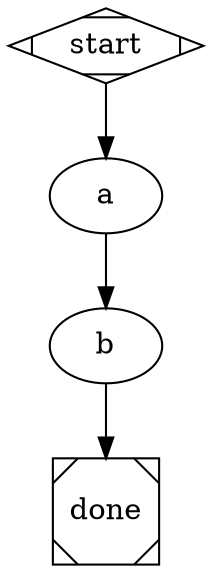

### Conditional Loop (retry on failure)

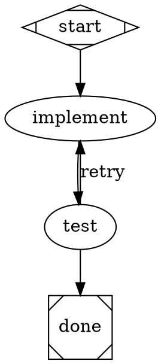

### Parallel Fan-Out

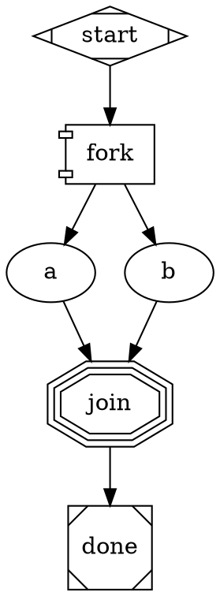

## Decision: Pipeline vs Direct

- **No pipeline**: Single file edit, simple question, < 2 steps.
- **Inline pipeline**: 2-4 ordered steps, clear sequence, no branching.
- **Full pipeline**: Branches, retries, parallel work, quality gates, human review.
```

---

### Practical Pipelines

#### 1. `practical/pr-review.dot` — Pull Request Review

**Purpose**: Automated multi-dimensional PR review with parallel analysis streams.

**Node structure:**
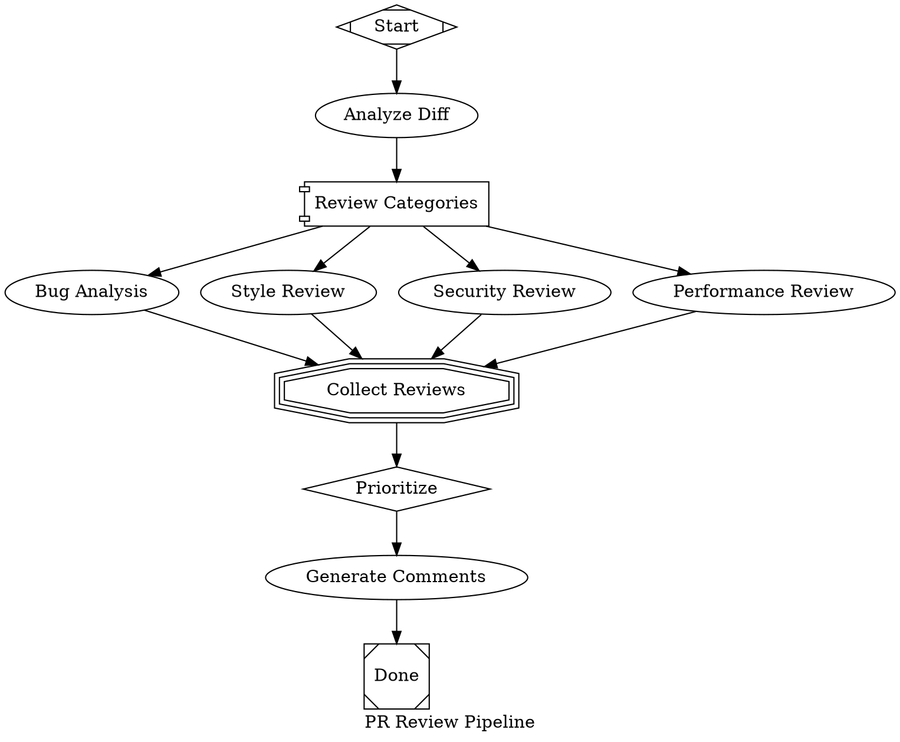

**What makes it useful**: Parallel review streams mean 4x coverage in roughly the same wall-clock time as 1 review. The prioritize step prevents comment noise. The model stylesheet uses o3-mini for the prioritization decision (reasoning-heavy) and Claude for the code analysis (tool-use-heavy).

**Optimal stylesheet**: Claude Sonnet for code-reading nodes (review_bugs, review_style, review_security, review_perf, generate_comments). o3-mini for the prioritize diamond (reasoning-heavy ranking task).

---

#### 2. `practical/test-gen.dot` — Test Generation with Validation Loop

**Purpose**: Generate tests, run them, fix failures in a retry loop.

**Node structure:**
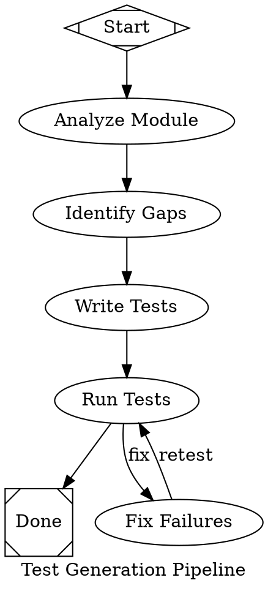

**What makes it useful**: The retry loop between run_tests and fix_failures means the pipeline is self-healing — it doesn't just generate tests, it validates them and fixes failures. The `goal_gate` on write_tests ensures the pipeline won't exit until tests exist.

**Optimal stylesheet**: Claude Sonnet for all nodes (strong at code generation and tool use).

---

#### 3. `practical/bug-fix.dot` — Systematic Bug Fix

**Purpose**: Reproduce, diagnose, fix, verify — the systematic debugging workflow.

**Node structure:**
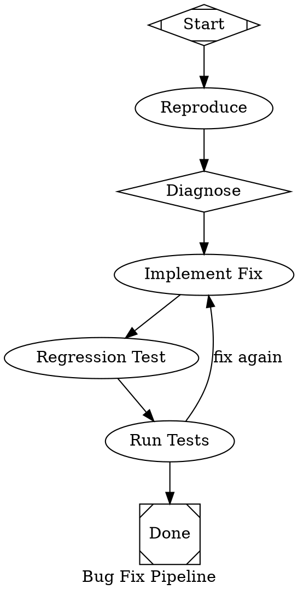

**What makes it useful**: Forces the disciplined reproduce-first workflow. The diagnose node uses o3-mini (via stylesheet) for deeper reasoning. The regression test ensures the bug stays fixed. The retry loop catches cases where the fix breaks other tests.

**Optimal stylesheet**: o3-mini for diagnosis (reasoning task), Claude Sonnet for code modification nodes.

---

#### 4. `practical/feature-build.dot` — Feature Build with Parallel Implementation

**Purpose**: Parse a spec, break into subtasks, implement in parallel, integration test.

**Node structure:**
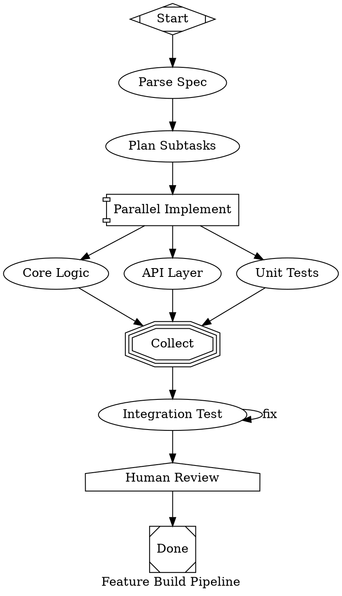

**What makes it useful**: Parallel implementation of independent subtasks. The plan_subtasks stage explicitly ensures no file conflicts. The human gate before finalization gives the developer a review checkpoint. Integration test with retry catches cross-branch issues.

**Optimal stylesheet**: Claude Sonnet for all implementation nodes (strong tool use), o3-mini for parse_spec (planning/reasoning).

---

#### 5. `practical/refactor.dot` — Safe Refactoring

**Purpose**: Analyze code smells, plan refactoring, execute with safety net of snapshot tests.

**Node structure:**
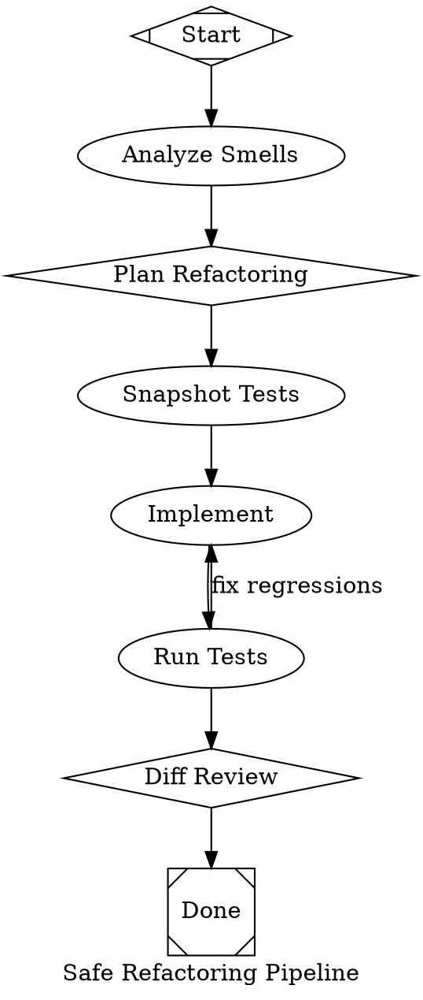

**What makes it useful**: The snapshot-first approach gives a safety net. The retry loop between run_tests and implement catches regressions immediately. The diff review at the end confirms behavior preservation. The plan stage (o3-mini) produces a reasoned refactoring strategy.

**Optimal stylesheet**: o3-mini for plan and diff_review (reasoning tasks), Claude Sonnet for implementation nodes.

---

## Batch 3: Documentation + $param Expansion

### README Rewrite

Flip the README from architecture-first to user-first. New structure:

```markdown
# Attractor

Multi-stage AI pipelines for code. Plan, implement, test, review — orchestrated as
directed graphs.

## Quick Start (30 seconds)

1. Add Attractor to your Amplifier config:
   ```yaml
   includes:
     - bundle: git+https://github.com/microsoft/amplifier-bundle-attractor@main#subdirectory=profiles/attractor-profile-anthropic
   ```

2. Ask the agent to run a pipeline:
   > "Run the plan-implement-test pipeline to add input validation to the login endpoint"

3. Or run directly from the CLI:
   ```bash
   amp run --agent attractor-anthropic --goal "Add input validation" \
       --dot-file examples/pipelines/02-plan-implement-test.dot
   ```

4. Or generate a pipeline on-the-fly:
   > "Build a test suite for the auth module using a parallel pipeline"

## What Can It Do?

**Fix a bug systematically**: Reproduce -> diagnose -> fix -> regression test -> verify
```
amp run --dot-file practical/bug-fix.dot --goal "Fix the NullPointerError in UserService.getProfile()"
```

**Review a PR in parallel**: Analyze diff, then simultaneously check for bugs, security issues,
performance problems, and style — then prioritize and generate review comments.
```
amp run --dot-file practical/pr-review.dot --goal "Review PR #142"
```

**Build a feature safely**: Parse spec -> parallel implement (core, API, tests) ->
integration test -> human review gate.
```
amp run --dot-file practical/feature-build.dot --goal "Add user avatar upload with S3 storage"
```

## Pipeline Gallery

| Pipeline | Pattern | Use Case |
|----------|---------|----------|
| [Simple Linear](examples/pipelines/01-simple-linear.dot) | `A -> B -> C` | Quick single-task |
| [Plan-Implement-Test](examples/pipelines/02-plan-implement-test.dot) | `plan -> impl -> test` | Standard dev workflow |
| [PR Review](practical/pr-review.dot) | Parallel analysis | Code review |
| [Test Generation](practical/test-gen.dot) | Retry loop | Test authoring |
| [Bug Fix](practical/bug-fix.dot) | Diagnose + verify | Debugging |
| [Feature Build](practical/feature-build.dot) | Parallel + gate | Feature development |
| [Refactoring](practical/refactor.dot) | Snapshot safety | Code improvement |
| [Conditional Routing](examples/pipelines/03-conditional-routing.dot) | `if/else` branches | Outcome-based flow |
| [Retry with Fallback](examples/pipelines/04-retry-with-fallback.dot) | Retry loop | Resilient execution |
| [Parallel Fan-Out](examples/pipelines/05-parallel-fan-out.dot) | Fork/join | Concurrent work |
| [Model Stylesheet](examples/pipelines/06-model-stylesheet.dot) | CSS-like config | Multi-provider |
| [Human Gate](examples/pipelines/08-human-gate.dot) | Approval gate | Human-in-the-loop |

## DOT Syntax

See [DOT-SYNTAX.md](docs/DOT-SYNTAX.md) for the complete reference.

Quick version: pipelines are Graphviz DOT digraphs where node shapes determine behavior:

| Shape | What it does |
|-------|-------------|
| `Mdiamond` | Start node (entry point) |
| `Msquare` | Exit node (pipeline end) |
| `box` | LLM agent node (default) |
| `component` | Parallel fan-out |
| `tripleoctagon` | Parallel fan-in (collect results) |
| `house` | Human approval gate |
| `diamond` | Decision/routing node |

## Available Profiles

| Profile | Provider | Best For |
|---------|----------|----------|
| `attractor-profile-anthropic` | Anthropic Claude | Tool-heavy coding tasks |
| `attractor-profile-openai` | OpenAI | Reasoning-heavy analysis |
| `attractor-profile-gemini` | Gemini | Large context tasks |

## Architecture

<details>
<summary>Click to expand architecture details</summary>

### Layers

- **attractor-core** (behavior): Provider-agnostic tools and hooks shared by all profiles.
- **Profiles**: Each profile includes attractor-core and adds a provider, orchestrator,
  provider-specific tools, and a system prompt.
- **Modules**: Self-contained Amplifier modules, each independently testable.

### Repository Structure
... (existing structure, moved here)

### Module Responsibilities
... (existing table, moved here)

</details>

## Development
... (existing content)
```

**File to change:** `README.md` — full rewrite.

---

### DOT Syntax Cheat Sheet

Create `docs/DOT-SYNTAX.md`:

```markdown
# DOT Syntax Cheat Sheet

One-page reference for writing Attractor pipelines.

## Minimal Valid Pipeline

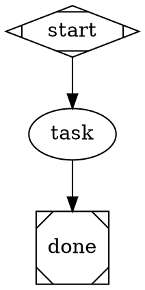

## Shape → Handler Mapping

| Shape | Handler | Description | LLM? |
|-------|---------|-------------|------|
| `Mdiamond` | start | Pipeline entry point | No |
| `Msquare` | exit | Pipeline exit, triggers goal gates | No |
| `box` | codergen | LLM agent with full tool access | Yes |
| `ellipse` | codergen | Alias for box | Yes |
| `diamond` | codergen | Conventionally for decisions/routing | Yes |
| `component` | parallel | Runs all outgoing edges concurrently | No |
| `tripleoctagon` | fan_in | Collects results from parallel branches | No |
| `house` | human_gate | Pauses for human approval | No |

## Node Attributes Quick Reference

| Attribute | Type | Default | Description |
|-----------|------|---------|-------------|
| `prompt` | string | — | Instructions for the LLM. `$goal` is expanded. |
| `goal_gate` | bool | false | Must succeed for pipeline to complete |
| `max_retries` | int | graph default | Retry count on failure |
| `retry_target` | string | — | Node to jump to on gate failure |
| `fidelity` | string | "compact" | Context carryover mode |
| `llm_provider` | string | — | Override provider (anthropic/openai/gemini) |
| `llm_model` | string | — | Override model name |
| `reasoning_effort` | string | — | low/medium/high (provider-dependent) |
| `auto_status` | bool | false | Force SUCCESS regardless of outcome |
| `timeout` | string | — | Per-node timeout (e.g. "30s", "2m") |
| `class` | string | — | CSS class for model stylesheet matching |

## Edge Attributes Quick Reference

| Attribute | Type | Description |
|-----------|------|-------------|
| `condition` | string | Python expression: `outcome == 'success'` |
| `label` | string | Matched against node's `preferred_label` |
| `weight` | int | Higher = preferred when multiple edges match |
| `fidelity` | string | Override fidelity for this transition |
| `thread_id` | string | Share message history across edges with same ID |

## Graph Attributes Quick Reference

| Attribute | Type | Description |
|-----------|------|-------------|
| `goal` | string | Pipeline objective. Expands `$goal` in prompts. |
| `default_fidelity` | string | Default fidelity for all nodes |
| `default_max_retry` | int | Default retry count for all nodes |
| `retry_target` | string | Global fallback retry target |
| `max_pipeline_duration` | string | Timeout for entire pipeline (e.g. "10m") |
| `model_stylesheet` | string | CSS-like rules for model/provider config |
| `params` | string | Comma-separated list of $param names |

## Model Stylesheet

```dot
graph [model_stylesheet="
    box { llm_provider=anthropic; llm_model=claude-sonnet-4-20250514 }
    diamond { llm_provider=openai; llm_model=o3-mini; reasoning_effort=high }
    .fast { llm_model=claude-haiku-3-5-20241022 }
"]
```

Selectors match node shapes or classes (`.classname`).

## Copy-Paste Patterns

### Linear (3 stages)
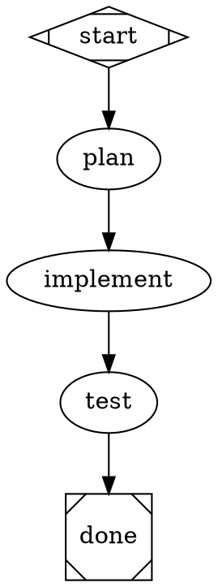

### Retry Loop
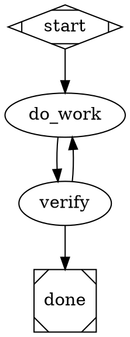

### Parallel Fan-Out/In
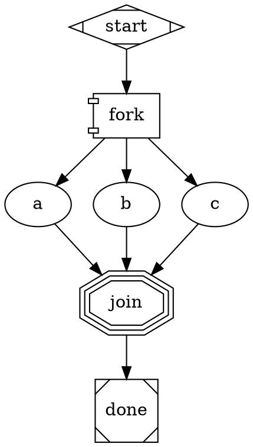

### Conditional Branch
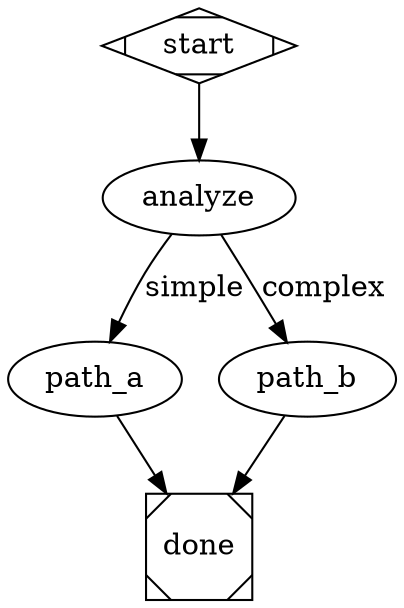

### Human Approval Gate
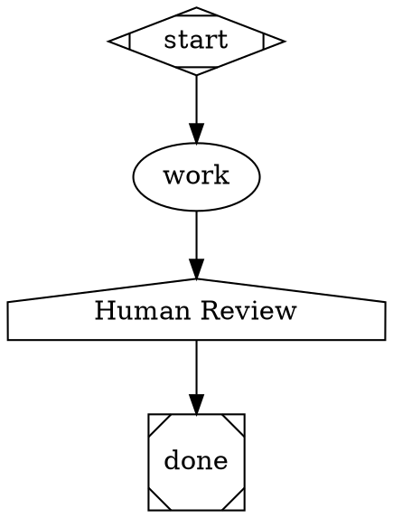

## Common Mistakes

| Mistake | Fix |
|---------|-----|
| Forgetting `shape=Mdiamond` on start | Every pipeline needs exactly one Mdiamond |
| Forgetting `shape=Msquare` on exit | Every pipeline needs at least one Msquare |
| Using `goal_gate=true` without `retry_target` | Gate failure with no retry = pipeline fails |
| Condition on wrong context key | Use `outcome` not `status` |
| Missing edge from node | Every non-exit node needs at least one outgoing edge |
| `$goal` not expanding | Ensure graph has `goal="..."` attribute set |
| Fan-in without fan-out | `tripleoctagon` expects `parallel.results` in context |
```

**File to create:** `docs/DOT-SYNTAX.md`

---

### $param Template Expansion

#### Current State

`transforms.py` (lines 71-95) only expands `$goal`:

```python
def expand_variables(graph: Graph, context: PipelineContext) -> Graph:
    # ...
    for node in graph.nodes.values():
        if node.prompt and "$goal" in node.prompt:
            node.prompt = expand_goal_variable(node.prompt, graph_goal, context_goal)
    return graph
```

The `expand_goal_variable` function (lines 31-45) does a simple `text.replace("$goal", goal_value)`.

#### Design

**Step 1: Extend `expand_variables` to support `$param` patterns**

```python
# transforms.py — new function

def expand_params(text: str, params: dict[str, str]) -> str:
    """Replace $param_name tokens in text with values from params dict.

    Only expands params that are explicitly declared. Unknown $tokens are
    left unchanged (backward compatible with existing $goal handling).

    Args:
        text: The text containing $param tokens.
        params: Dict mapping param names to values.

    Returns:
        Text with $param tokens replaced.
    """
    for key, value in params.items():
        text = text.replace(f"${key}", str(value))
    return text
```

**Step 2: Update `expand_variables` to call `expand_params`**

```python
def expand_variables(graph: Graph, context: PipelineContext) -> Graph:
    """Replace $goal and $param tokens in node prompts."""
    context_goal = context.get("graph.goal") or ""
    graph_goal = graph.goal or ""

    # Resolve params from context (set by tool-pipeline-run)
    params: dict[str, str] = context.get("graph.params_values") or {}

    for node in graph.nodes.values():
        if not node.prompt:
            continue
        if "$goal" in node.prompt:
            node.prompt = expand_goal_variable(node.prompt, graph_goal, context_goal)
        if params and "$" in node.prompt:
            node.prompt = expand_params(node.prompt, params)

    return graph
```

**Step 3: Update Graph to support `params` declaration**

The `params` graph attribute (comma-separated string) declares which `$param` names the pipeline expects. This is informational — used by the tool for validation and by documentation for discoverability.

No changes to `graph.py` needed — the `params` attribute is already stored in `graph_attrs` as a plain string.

**Step 4: Update tool-pipeline-run input schema**

Add `params` to the tool's `input_schema` and pass it through to the orchestrator:

```python
# tool-pipeline-run/__init__.py — update input_schema property

@property
def input_schema(self) -> dict:
    return {
        "type": "object",
        "properties": {
            "dot_file": { ... },  # existing
            "dot_source": { ... },  # existing
            "goal": { ... },  # existing
            "provider": { ... },  # existing
            "params": {
                "type": "object",
                "description": (
                    "Key-value parameters for $param expansion in node prompts. "
                    "Example: {\"language\": \"Python\", \"framework\": \"FastAPI\"} "
                    "expands $language and $framework in prompts."
                ),
                "additionalProperties": {"type": "string"},
            },
        },
        "required": ["goal"],
    }
```

**Step 5: Pass params through spawn**

In `execute()`, pass params to the orchestrator config:

```python
# tool-pipeline-run/__init__.py — in execute(), after building orchestrator_config

params = input.get("params", {})
if params:
    orchestrator_config["params"] = params
```

**Step 6: Orchestrator passes params to context**

In `PipelineOrchestrator.execute()`, set params in the pipeline context:

```python
# __init__.py — after line 325 (pipeline_context.set("graph.goal", prompt))

params = self.config.get("params", {})
if params:
    pipeline_context.set("graph.params_values", params)
```

**Files to change:**
| File | Location | Change |
|------|----------|--------|
| `modules/loop-pipeline/.../transforms.py` | Lines 71-95 | Add `expand_params()`, update `expand_variables()` |
| `modules/tool-pipeline-run/.../__init__.py` | Lines 52-84 | Add `params` to input schema |
| `modules/tool-pipeline-run/.../__init__.py` | Lines 382-389 | Forward `params` in orchestrator config |
| `modules/loop-pipeline/.../__init__.py` | Lines 322-326 | Set `graph.params_values` in context |

**Example usage:**

Pipeline DOT:
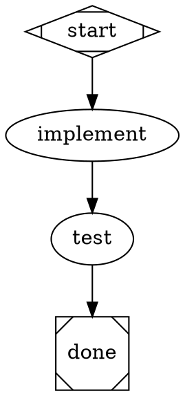

Tool call:
```json
{
    "goal": "Build a REST API with user authentication",
    "dot_file": "template.dot",
    "params": {
        "language": "Python",
        "framework": "FastAPI"
    }
}
```

Expanded prompts:
- implement: "Create a FastAPI app in Python that: Build a REST API with user authentication"
- test: "Write Python tests for the FastAPI app"

---

## Effort Estimates

| Item | Files | Complexity | Effort |
|------|-------|-----------|--------|
| **Batch 1** | | | |
| Bug 1: "No Output" fix | 2 files | Medium — new summary builder + tool result parsing | 2-3 hours |
| Bug 2: `wait` after pipeline | 2 files | Low — context rewrite + ToolResult message | 1 hour |
| **Batch 2** | | | |
| `context/dot-reference.md` | 1 new file | Medium — content authoring, needs testing with LLM | 2 hours |
| `pipeline-awareness.md` update | 1 file | Low — add decision heuristic + DOT reference link | 30 min |
| `practical/pr-review.dot` | 1 new file | Medium — parallel pattern, needs E2E validation | 1.5 hours |
| `practical/test-gen.dot` | 1 new file | Medium — retry loop, needs E2E validation | 1.5 hours |
| `practical/bug-fix.dot` | 1 new file | Medium — multi-stage + stylesheet | 1.5 hours |
| `practical/feature-build.dot` | 1 new file | High — parallel + human gate + retry | 2 hours |
| `practical/refactor.dot` | 1 new file | Medium — snapshot pattern, retry loop | 1.5 hours |
| **Batch 3** | | | |
| README rewrite | 1 file | Low — restructuring existing content | 1.5 hours |
| `docs/DOT-SYNTAX.md` | 1 new file | Medium — comprehensive reference | 2 hours |
| $param expansion | 4 files | Medium — transforms + tool schema + plumbing | 3-4 hours |
| **Total** | ~15 files | | **~20 hours** |

### Recommended Implementation Order

1. **Bug 1 + Bug 2** (same PR) — immediate UX improvement, low risk
2. **$param expansion** — enables the practical pipelines to be parameterized
3. **`dot-reference.md` + `pipeline-awareness.md`** — enables generative pipeline
4. **5 practical pipelines** — depends on $param being available
5. **`DOT-SYNTAX.md` + README** — documentation layer on top of everything
