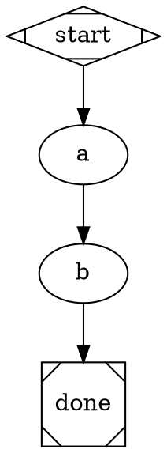
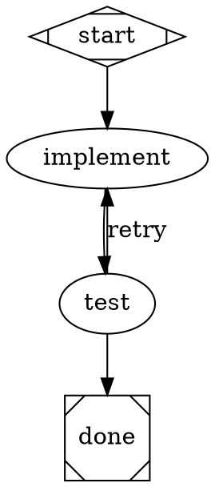
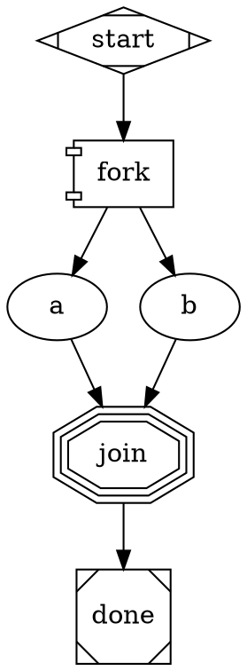
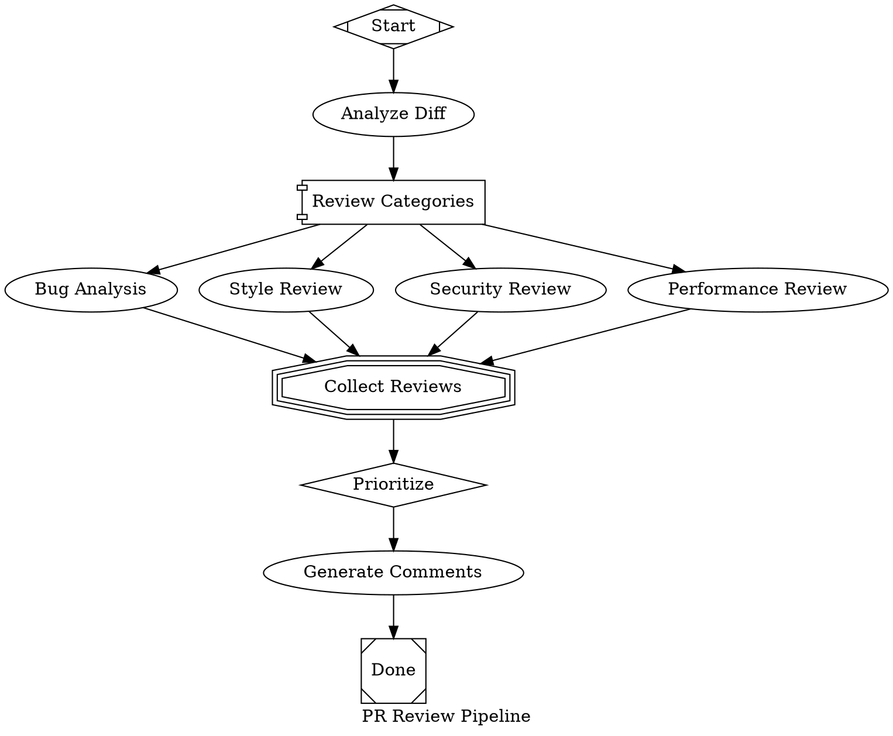
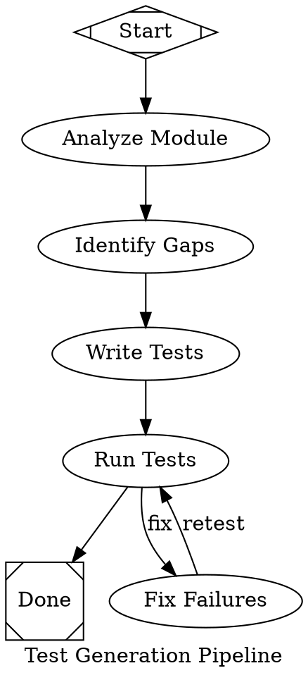
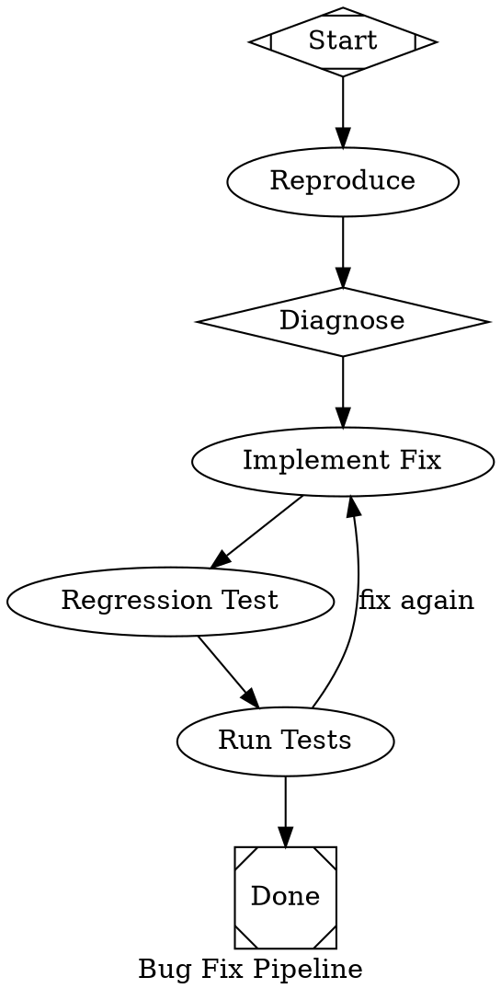
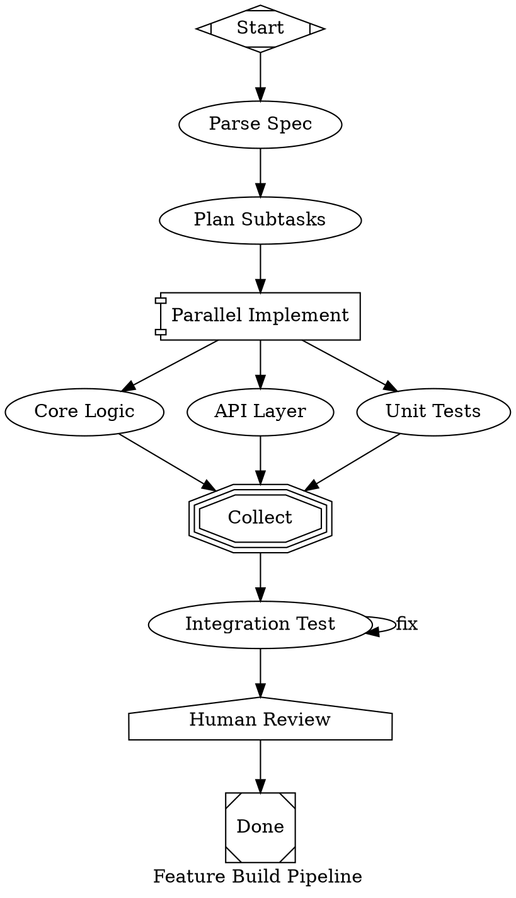
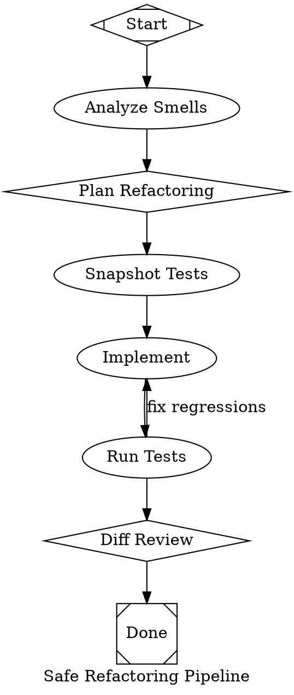

# UX Polish Implementation Plan

> **Execution:** Use the subagent-driven-development workflow to implement this plan.

**Goal:** Fix two P0 bugs (empty pipeline output, spurious `wait` calls), add generative pipeline support with 5 practical pipelines, rewrite docs, and implement `$param` template expansion.
**Architecture:** Three batches of increasing scope. Batch 1 fixes the output chain (engine → orchestrator → tool) and context guidance. Batch 2 adds a DOT reference card, decision heuristic, and 5 real-world pipeline templates. Batch 3 rewrites user-facing docs and extends the transform system for parameterized pipelines.
**Tech Stack:** Python 3.11+, pytest + pytest-asyncio (strict mode), Graphviz DOT, Amplifier module system.

---

## Batch 1: Bug Fixes (P0)

### Task 1.1: Fix "No Output" — Orchestrator Summary Builder

**Files:**
- Modify: `modules/loop-pipeline/amplifier_module_loop_pipeline/__init__.py` (lines 376–384)
- Test: `modules/loop-pipeline/tests/test_orchestrator_summary.py` (create)

**Dependencies:** None
**Effort:** M (medium)

**Step 1: Write the failing test**

Create `modules/loop-pipeline/tests/test_orchestrator_summary.py`:

```python
"""Tests for pipeline summary building in PipelineOrchestrator.

Covers Bug 1 fix: ensures the orchestrator produces a meaningful summary
even when the final node's outcome has no notes.
"""

import json

import pytest

from amplifier_module_loop_pipeline import PipelineOrchestrator
from amplifier_module_loop_pipeline.context import PipelineContext
from amplifier_module_loop_pipeline.engine import PipelineEngine
from amplifier_module_loop_pipeline.graph import Graph, Node
from amplifier_module_loop_pipeline.handlers import HandlerRegistry
from amplifier_module_loop_pipeline.outcome import Outcome, StageStatus


# --- Mock backend that returns outcomes with no notes ---


class _NullNotesBackend:
    """Backend that returns SUCCESS with notes=None for every node."""

    async def run(self, node, prompt, context, **kwargs):
        return Outcome(status=StageStatus.SUCCESS, notes=None)


class _RichNotesBackend:
    """Backend that returns SUCCESS with meaningful notes."""

    async def run(self, node, prompt, context, **kwargs):
        return Outcome(
            status=StageStatus.SUCCESS,
            notes=f"Completed node {node.id} with full results and details that are meaningful",
        )


# --- _build_pipeline_summary ---


def test_summary_with_null_notes():
    """Orchestrator builds a summary when outcome.notes is None."""
    orchestrator = PipelineOrchestrator({"dot_source": "digraph { s [shape=Mdiamond]; d [shape=Msquare]; s -> d }"})
    engine = _make_engine_with_completed_nodes(notes=None)
    outcome = Outcome(status=StageStatus.SUCCESS, notes=None)

    summary = orchestrator._build_pipeline_summary(engine, outcome)

    assert summary is not None
    assert len(summary) > 20
    assert "completed" in summary.lower() or "succeeded" in summary.lower()


def test_summary_with_short_notes():
    """Orchestrator synthesizes when outcome.notes is too short to be useful."""
    orchestrator = PipelineOrchestrator({"dot_source": "digraph { s [shape=Mdiamond]; d [shape=Msquare]; s -> d }"})
    engine = _make_engine_with_completed_nodes(notes="ok")
    outcome = Outcome(status=StageStatus.SUCCESS, notes="ok")

    summary = orchestrator._build_pipeline_summary(engine, outcome)

    assert len(summary) > 20


def test_summary_preserves_meaningful_notes():
    """Orchestrator uses outcome.notes when they are already meaningful."""
    orchestrator = PipelineOrchestrator({"dot_source": "digraph { s [shape=Mdiamond]; d [shape=Msquare]; s -> d }"})
    engine = _make_engine_with_completed_nodes(notes=None)
    long_notes = "This is a detailed description of what the pipeline accomplished across all stages."
    outcome = Outcome(status=StageStatus.SUCCESS, notes=long_notes)

    summary = orchestrator._build_pipeline_summary(engine, outcome)

    assert summary == long_notes


def test_summary_includes_node_count():
    """Summary includes how many nodes completed."""
    orchestrator = PipelineOrchestrator({"dot_source": "digraph { s [shape=Mdiamond]; d [shape=Msquare]; s -> d }"})
    engine = _make_engine_with_completed_nodes(notes=None, node_count=3)
    outcome = Outcome(status=StageStatus.SUCCESS, notes=None)

    summary = orchestrator._build_pipeline_summary(engine, outcome)

    assert "3" in summary


def test_summary_includes_failed_nodes():
    """Summary mentions failed nodes when present."""
    orchestrator = PipelineOrchestrator({"dot_source": "digraph { s [shape=Mdiamond]; d [shape=Msquare]; s -> d }"})
    engine = _make_engine_with_mixed_outcomes()
    outcome = Outcome(status=StageStatus.PARTIAL_SUCCESS, notes=None)

    summary = orchestrator._build_pipeline_summary(engine, outcome)

    assert "fail" in summary.lower() or "Failed" in summary


# --- Helpers ---


def _make_engine_with_completed_nodes(
    notes: str | None,
    node_count: int = 2,
) -> PipelineEngine:
    """Create a PipelineEngine with fake completed nodes."""
    from amplifier_module_loop_pipeline.dot_parser import parse_dot
    from amplifier_module_loop_pipeline.validation import validate_or_raise

    dot = "digraph { start [shape=Mdiamond]; a [prompt=\"A\"]; b [prompt=\"B\"]; done [shape=Msquare]; start -> a -> b -> done }"
    graph = parse_dot(dot)
    validate_or_raise(graph)
    context = PipelineContext()
    registry = HandlerRegistry(backend=None)
    engine = PipelineEngine(
        graph=graph, context=context, handler_registry=registry, logs_root="/tmp/test-summary",
    )
    # Simulate completed nodes
    node_ids = [nid for nid in graph.nodes if graph.nodes[nid].shape not in ("Mdiamond", "Msquare")]
    for nid in node_ids[:node_count]:
        engine.completed_nodes.append(nid)
        engine.node_outcomes[nid] = Outcome(status=StageStatus.SUCCESS, notes=notes)
    return engine


def _make_engine_with_mixed_outcomes() -> PipelineEngine:
    """Create a PipelineEngine with both successful and failed nodes."""
    from amplifier_module_loop_pipeline.dot_parser import parse_dot
    from amplifier_module_loop_pipeline.validation import validate_or_raise

    dot = "digraph { start [shape=Mdiamond]; a [prompt=\"A\"]; b [prompt=\"B\"]; done [shape=Msquare]; start -> a -> b -> done }"
    graph = parse_dot(dot)
    validate_or_raise(graph)
    context = PipelineContext()
    registry = HandlerRegistry(backend=None)
    engine = PipelineEngine(
        graph=graph, context=context, handler_registry=registry, logs_root="/tmp/test-summary",
    )
    node_ids = [nid for nid in graph.nodes if graph.nodes[nid].shape not in ("Mdiamond", "Msquare")]
    engine.completed_nodes.append(node_ids[0])
    engine.node_outcomes[node_ids[0]] = Outcome(status=StageStatus.SUCCESS, notes="Done")
    engine.completed_nodes.append(node_ids[1])
    engine.node_outcomes[node_ids[1]] = Outcome(status=StageStatus.FAIL, failure_reason="test error")
    return engine
```

**Step 2: Run test to verify it fails**

```bash
cd modules/loop-pipeline && uv run pytest tests/test_orchestrator_summary.py -v
```
Expected: FAIL — `AttributeError: 'PipelineOrchestrator' object has no attribute '_build_pipeline_summary'`

**Step 3: Implement `_build_pipeline_summary` and update `execute()`**

In `modules/loop-pipeline/amplifier_module_loop_pipeline/__init__.py`, add the `_build_pipeline_summary` method to `PipelineOrchestrator` (after the `_resolve_dot_source` method, around line 399) and update the `execute()` method's result-building block (lines 376–384).

Add this method to `PipelineOrchestrator`:

```python
def _build_pipeline_summary(self, engine: PipelineEngine, outcome: Outcome) -> str:
    """Build a human-readable pipeline summary.

    If the final outcome has meaningful notes, use them.
    Otherwise, synthesize a summary from all completed nodes.
    """
    # Use the outcome's notes if they exist and are meaningful
    if outcome.notes and len(outcome.notes) > 20:
        return outcome.notes

    # Synthesize from all node outcomes
    parts: list[str] = []
    total = len(engine.completed_nodes)
    succeeded = sum(
        1 for nid in engine.completed_nodes
        if nid in engine.node_outcomes
        and engine.node_outcomes[nid].is_success
    )
    failed = total - succeeded

    parts.append(f"Pipeline completed: {succeeded}/{total} nodes succeeded.")

    if failed:
        failed_nodes = [
            nid for nid in engine.completed_nodes
            if nid in engine.node_outcomes
            and not engine.node_outcomes[nid].is_success
        ]
        parts.append(f"Failed nodes: {', '.join(failed_nodes)}.")

    # Include the last node's notes if available
    if engine.completed_nodes:
        last_id = engine.completed_nodes[-1]
        last_out = engine.node_outcomes.get(last_id)
        if last_out and last_out.notes:
            # Truncate to avoid bloating the summary
            snippet = last_out.notes[:300]
            parts.append(f"Last node ({last_id}): {snippet}")

    return " ".join(parts)
```

Replace the result-building block in `execute()` (lines 376–384) with:

```python
        # 11. Run the engine
        outcome = await engine.run(goal=prompt or None)

        # 12. Build a meaningful summary from all completed nodes
        summary = self._build_pipeline_summary(engine, outcome)

        # 13. Return the final outcome as JSON
        result = {
            "status": outcome.status.value,
            "notes": summary,
            "failure_reason": outcome.failure_reason,
            "nodes_completed": len(engine.completed_nodes),
            "node_statuses": {
                nid: engine.node_outcomes[nid].status.value
                for nid in engine.completed_nodes
                if nid in engine.node_outcomes
            },
        }
        return json.dumps(result)
```

**Step 4: Run test to verify it passes**

```bash
cd modules/loop-pipeline && uv run pytest tests/test_orchestrator_summary.py -v
```
Expected: All 5 tests PASS.

**Step 5: Run the full loop-pipeline test suite**

```bash
cd modules/loop-pipeline && uv run pytest tests/ -q
```
Expected: All existing tests still pass. No regressions.

**Step 6: Commit**

```bash
git add modules/loop-pipeline/amplifier_module_loop_pipeline/__init__.py modules/loop-pipeline/tests/test_orchestrator_summary.py
git commit -m "fix: build meaningful pipeline summary instead of returning null notes

Adds _build_pipeline_summary() to PipelineOrchestrator that synthesizes
a human-readable summary from all completed node outcomes when the final
outcome's notes are None or too short. Also adds nodes_completed and
node_statuses to the JSON result for richer downstream consumption.

Fixes the 'No Output' bug where pipeline_notes was null/empty."
```

---

### Task 1.2: Fix "No Output" — Tool Result Parsing

**Files:**
- Modify: `modules/tool-pipeline-run/amplifier_module_tool_pipeline_run/__init__.py` (lines 453–491)
- Test: `modules/tool-pipeline-run/tests/test_pipeline_run.py` (add tests)

**Dependencies:** Task 1.1 (the JSON shape changed — adds `nodes_completed` and `node_statuses`)
**Effort:** S (small)

**Step 1: Read existing test file**

Read `modules/tool-pipeline-run/tests/test_pipeline_run.py` to understand existing test patterns and where to add new tests.

**Step 2: Write failing tests**

Add these tests to `modules/tool-pipeline-run/tests/test_pipeline_run.py`:

```python
# --- Pipeline output parsing (Bug 1 Fix B) ---


def test_parse_null_notes_from_pipeline_output():
    """Tool synthesizes a summary when pipeline returns null notes."""
    import json

    output = json.dumps({
        "status": "success",
        "notes": None,
        "failure_reason": None,
        "nodes_completed": 3,
        "node_statuses": {"plan": "success", "implement": "success", "test": "success"},
    })

    # Simulate the parsing logic
    parsed = json.loads(output)
    pipeline_notes = parsed.get("notes") or ""
    nodes_completed = parsed.get("nodes_completed", 0)
    node_statuses = parsed.get("node_statuses", {})

    if not pipeline_notes.strip():
        summary_parts = [f"Pipeline finished with status: {parsed.get('status', 'success')}."]
        if nodes_completed:
            summary_parts.append(f"{nodes_completed} nodes executed.")
        if node_statuses:
            summary_parts.append(
                "Node results: " +
                ", ".join(f"{k}={v}" for k, v in node_statuses.items())
            )
        pipeline_notes = " ".join(summary_parts)

    assert pipeline_notes
    assert "3 nodes executed" in pipeline_notes
    assert "plan=success" in pipeline_notes


def test_parse_empty_string_notes_from_pipeline_output():
    """Tool synthesizes a summary when pipeline returns empty-string notes."""
    import json

    output = json.dumps({
        "status": "success",
        "notes": "",
        "nodes_completed": 2,
        "node_statuses": {"a": "success", "b": "fail"},
    })

    parsed = json.loads(output)
    pipeline_notes = parsed.get("notes") or ""

    assert not pipeline_notes.strip()  # Confirms we need to synthesize
```

**Step 3: Run tests to verify they pass (these are unit logic tests, not integration)**

```bash
cd modules/tool-pipeline-run && uv run pytest tests/test_pipeline_run.py -v -k "parse_null_notes or parse_empty_string"
```
Expected: PASS (these test the target logic directly).

**Step 4: Update the tool's result parsing**

In `modules/tool-pipeline-run/amplifier_module_tool_pipeline_run/__init__.py`, replace lines 453–491 (the result parsing and ToolResult return block) with:

```python
        # --- Parse result ---
        output = (
            result.get("output", "")
            if isinstance(result, dict)
            else str(result)
        )
        session_id = (
            result.get("session_id", "unknown")
            if isinstance(result, dict)
            else "unknown"
        )

        # Try to parse structured outcome from pipeline output
        pipeline_status = "success"
        pipeline_notes = ""
        nodes_completed = 0
        node_statuses: dict[str, str] = {}

        if isinstance(output, str) and output.strip().startswith("{"):
            try:
                parsed = json.loads(output)
                pipeline_status = parsed.get("status", "success")
                pipeline_notes = parsed.get("notes") or ""
                nodes_completed = parsed.get("nodes_completed", 0)
                node_statuses = parsed.get("node_statuses", {})
            except (json.JSONDecodeError, AttributeError):
                pipeline_notes = output[:500] if output else ""
        else:
            # Plain text output — use as notes
            pipeline_notes = output[:500] if output else ""

        # Synthesize a summary if notes are still empty
        if not pipeline_notes.strip():
            summary_parts = [f"Pipeline finished with status: {pipeline_status}."]
            if nodes_completed:
                summary_parts.append(f"{nodes_completed} nodes executed.")
            if node_statuses:
                summary_parts.append(
                    "Node results: "
                    + ", ".join(f"{k}={v}" for k, v in node_statuses.items())
                )
            pipeline_notes = " ".join(summary_parts)

        # --- Progress: pipeline complete ---
        self._show_progress(
            f"[PIPELINE] Pipeline complete: {pipeline_status} ({duration}s)"
        )
        await self._emit_event(
            "pipeline:tool:complete",
            {
                "status": pipeline_status,
                "session_id": session_id,
                "duration_seconds": duration,
                "notes": pipeline_notes,
            },
        )

        return ToolResult(
            success=True,
            output={
                "status": pipeline_status,
                "session_id": session_id,
                "notes": pipeline_notes,
                "duration_seconds": duration,
                "runner_agent": runner_agent,
                "message": (
                    "Pipeline execution complete. The pipeline has finished "
                    "synchronously — no further action is needed for this pipeline."
                ),
            },
        )
```

**Step 5: Run full tool-pipeline-run test suite**

```bash
cd modules/tool-pipeline-run && uv run pytest tests/ -v
```
Expected: All tests PASS.

**Step 6: Commit**

```bash
git add modules/tool-pipeline-run/amplifier_module_tool_pipeline_run/__init__.py modules/tool-pipeline-run/tests/test_pipeline_run.py
git commit -m "fix: synthesize pipeline summary when notes are null/empty

Updates tool-pipeline-run result parsing to handle null/empty notes from
the orchestrator. Extracts nodes_completed and node_statuses from the
enriched JSON result. Synthesizes a human-readable summary when notes
are missing. Adds explicit 'message' field telling the LLM the pipeline
is complete and no follow-up action is needed."
```

---

### Task 1.3: Fix `wait` Confusion — Rewrite Pipeline Awareness Context

**Files:**
- Modify: `context/pipeline-awareness.md` (full rewrite)

**Dependencies:** Task 1.2 (the ToolResult shape referenced in the context must match)
**Effort:** S (small)

**Step 1: Write the new context file**

Replace the entire contents of `context/pipeline-awareness.md` with:

```markdown
# Pipeline Capabilities

You have access to the `run_pipeline` tool which can execute DOT graph pipelines.

## Critical: run_pipeline is SYNCHRONOUS

`run_pipeline` is a **synchronous** tool. When it returns, the pipeline is **fully
complete**. Do NOT call any of these after a pipeline run:
- `wait` — the pipeline is already done
- `close_agent` — the pipeline session is already closed
- `send_input` — there is no pending pipeline to send input to
- Any polling or status-check tool

When `run_pipeline` returns its result, simply read the result and respond to the
user with a summary of what the pipeline accomplished.

## When to Use Pipelines

Use `run_pipeline` when the user asks you to:
- Run a pipeline or workflow defined in a `.dot` file
- Execute a multi-step coding pipeline
- Run an Attractor pipeline

For simple tasks (1-2 straightforward steps), just do the work directly — no
pipeline needed.

## How to Use

Call `run_pipeline` with:
- **`goal`** (required): The task description. This replaces `$goal` in node prompts.
- **`dot_file`** (optional): Path to a `.dot` file. Supports `@attractor:` mentions.
- **`dot_source`** (optional): Inline DOT digraph string.
- **`params`** (optional): Key-value pairs for `$param` expansion in node prompts.

You must provide either `dot_file` or `dot_source`.

## Examples

Run a pipeline from a file:
```json
{
  "goal": "Refactor the authentication module to use async patterns",
  "dot_file": "@attractor:examples/pipelines/02-plan-implement-test.dot"
}
```

Run a simple inline pipeline:
```json
{
  "goal": "Add input validation to the user registration endpoint",
  "dot_source": "digraph { start [shape=Mdiamond]; implement [prompt=\"$goal\"]; test [prompt=\"Write tests for the changes\"]; done [shape=Msquare]; start -> implement -> test -> done }"
}
```

## Available Example Pipelines

- `@attractor:examples/pipelines/01-simple-linear.dot` — Minimal start -> implement -> done
- `@attractor:examples/pipelines/02-plan-implement-test.dot` — Plan, implement, test cycle
- `@attractor:examples/pipelines/03-conditional-routing.dot` — Conditional branching based on outcomes
- `@attractor:examples/pipelines/04-retry-with-fallback.dot` — Retry logic with fallback paths
- `@attractor:examples/pipelines/05-parallel-fan-out.dot` — Parallel execution with fan-in
- `@attractor:examples/pipelines/06-model-stylesheet.dot` — Multi-provider model selection

## After a Pipeline Completes

When `run_pipeline` returns, the result contains:
- `status` — "success", "partial_success", or "fail"
- `notes` — Summary of what was accomplished
- `duration_seconds` — How long it took
- `nodes_completed` — How many pipeline stages ran
- `message` — Confirmation that the pipeline is complete

Read the result and tell the user what happened. Do NOT call any follow-up tools
related to the pipeline — it is already complete.
```

**Step 2: Verify the context file is valid markdown**

```bash
wc -l context/pipeline-awareness.md
```
Expected: ~65 lines. Read it back to verify formatting.

**Step 3: Commit**

```bash
git add context/pipeline-awareness.md
git commit -m "fix: rewrite pipeline-awareness context with synchronous warning

Rewrites pipeline-awareness.md to explicitly tell the LLM that
run_pipeline is synchronous and no follow-up tools (wait, close_agent,
send_input) should be called after it returns. Adds 'After a Pipeline
Completes' section documenting the result shape.

Fixes the 'wait confusion' bug where the LLM called wait/close_agent
after a pipeline completed."
```

---

## Batch 2: Generative Pipeline + Practical Pipelines (P1)

### Task 2.1: Create DOT Reference Card Context

**Files:**
- Create: `context/dot-reference.md`
- Modify: `bundles/attractor-interactive.yaml` (add context include)

**Dependencies:** None (can run in parallel with Task 2.2)
**Effort:** M (medium — content authoring)

**Step 1: Create `context/dot-reference.md`**

Create file `context/dot-reference.md` with the following content:

```markdown
# DOT Pipeline Reference Card

Quick reference for generating Attractor DOT pipelines.

## Node Shapes → Handlers

| Shape | Handler | Purpose |
|-------|---------|---------|
| `Mdiamond` | (start) | Entry point — exactly one per graph |
| `Msquare` | (exit) | Terminal — triggers goal-gate check |
| `box` | codergen | Default. LLM agent with tools (code, files, bash) |
| `ellipse` | codergen | Same as box (alias for readability) |
| `diamond` | codergen | Decision node (conventionally used for branching) |
| `component` | parallel | Fan-out: runs all outgoing edges concurrently |
| `tripleoctagon` | fan_in | Fan-in: collects parallel branch results |
| `house` | human_gate | Pauses for human approval before proceeding |

## Essential Node Attributes

```dot
node_id [
    label="Human-readable name",
    prompt="Instructions for the LLM. Use $goal for the pipeline goal.",
    goal_gate=true,              // Must succeed for pipeline to pass
    max_retries=3,               // Retry on failure (default: graph-level)
    retry_target="node_id",      // Where to jump on gate failure
    fidelity="full|compact|summary:high|summary:low",
    llm_provider="anthropic",    // Override provider for this node
    llm_model="claude-sonnet-4-20250514", // Override model
    reasoning_effort="low|medium|high",
    auto_status=true,            // Force success regardless of outcome
    timeout="30s"                // Per-node timeout
]
```

## Edge Attributes

```dot
a -> b [
    condition="outcome == 'success'",   // Python expression on context
    label="success",                     // Match against preferred_label
    weight=10,                           // Higher = preferred (tiebreak)
    fidelity="full",                     // Override fidelity for this transition
    thread_id="shared_thread"            // Share message history across edges
]
```

## Graph Attributes

```dot
digraph MyPipeline {
    graph [
        goal="The overall objective — replaces $goal in prompts",
        default_fidelity="compact",
        default_max_retry=3,
        retry_target="some_node",          // Global fallback retry target
        max_pipeline_duration="5m",        // Abort if exceeded
        model_stylesheet="box { llm_provider=anthropic; llm_model=claude-sonnet-4-20250514 }
                          diamond { llm_provider=openai; llm_model=o3-mini }"
    ]
}
```

## Model Stylesheet Syntax

CSS-like rules that apply attributes to nodes by shape or class:

```
shape_or_class { key=value; key=value; }
```

Selectors: `box`, `ellipse`, `diamond`, `.my_class` (via `class="my_class"` on node).
Properties: `llm_provider`, `llm_model`, `reasoning_effort`, `max_retries`, `fidelity`.

## Condition Expression Syntax

Conditions are Python expressions evaluated against the pipeline context dict:

```
outcome == 'success'           // Last node's status
outcome == 'fail'              // Last node failed
preferred_label == 'approve'   // Human gate approved
graph.goal != ''               // Goal is set
```

Available context keys: `outcome`, `preferred_label`, `last_stage`, `last_response`,
`graph.goal`, `parallel.results`, plus any `context_updates` from prior nodes.

## 3 Patterns

### Linear



### Conditional Loop (retry on failure)



### Parallel Fan-Out



## Decision: Pipeline vs Direct

- **No pipeline**: Single file edit, simple question, < 2 steps.
- **Inline pipeline**: 2-4 ordered steps, clear sequence, no branching.
- **Full pipeline**: Branches, retries, parallel work, quality gates, human review.
```

**Step 2: Wire into bundle YAML**

Read `bundles/attractor-interactive.yaml` and add `context/dot-reference.md` to the `context.include` list, right after `context/pipeline-awareness.md`.

The `context.include` section should become:

```yaml
context:
  include:
    - context/system-anthropic.md
    - context/pipeline-awareness.md
    - context/dot-reference.md
```

**Step 3: Verify file sizes**

```bash
wc -w context/dot-reference.md
```
Expected: ~600–800 words (~2K tokens). Should not exceed 2.5K tokens.

**Step 4: Commit**

```bash
git add context/dot-reference.md bundles/attractor-interactive.yaml
git commit -m "feat: add DOT reference card context for generative pipelines

Creates context/dot-reference.md with node shape→handler table,
attribute references, model stylesheet syntax, condition expressions,
3 copy-paste patterns, and pipeline-vs-direct decision heuristic.
Wires it into attractor-interactive.yaml context includes."
```

---

### Task 2.2: Update Pipeline Awareness with Decision Heuristic

**Files:**
- Modify: `context/pipeline-awareness.md` (add decision heuristic section)

**Dependencies:** Task 1.3 (builds on the rewritten file)
**Effort:** S (small)

**Step 1: Add the decision heuristic section**

In `context/pipeline-awareness.md`, add the following section after the "When to Use Pipelines" section and before "How to Use":

```markdown
## Pipeline Decision Heuristic

When the user asks you to do a complex task, decide:

1. **Simple task (1-2 steps, no branching)** — Just do it directly. No pipeline.
   Example: "Add a docstring to this function" or "Fix the typo in README.md"

2. **Medium task (2-4 ordered steps)** — Generate an inline pipeline with `dot_source`.
   Example: "Refactor the auth module" becomes a plan -> implement -> test pipeline.

3. **Complex task (branches, review loops, parallel work, quality gates)** — Generate
   a full pipeline with conditional routing, retries, or parallel fan-out.
   Example: "Build a comprehensive test suite for 3 modules" uses parallel fan-out.

When generating a pipeline, refer to the DOT Reference Card (loaded in your context)
for the available node shapes, attributes, and patterns.
```

**Step 2: Also add the practical pipelines to the "Available Example Pipelines" list**

Append to the existing list:

```markdown

### Practical Pipelines

- `@attractor:examples/pipelines/practical/pr-review.dot` — Parallel multi-dimension PR review
- `@attractor:examples/pipelines/practical/test-gen.dot` — Test generation with validation loop
- `@attractor:examples/pipelines/practical/bug-fix.dot` — Systematic reproduce → diagnose → fix → verify
- `@attractor:examples/pipelines/practical/feature-build.dot` — Parallel implementation with human review gate
- `@attractor:examples/pipelines/practical/refactor.dot` — Safe refactoring with snapshot tests
```

**Step 3: Commit**

```bash
git add context/pipeline-awareness.md
git commit -m "feat: add pipeline decision heuristic and practical pipeline list

Adds a 3-tier decision heuristic (simple/medium/complex) to help the
LLM decide when to use pipelines vs direct action. Adds practical
pipeline references to the available pipelines list."
```

---

### Task 2.3: Create Practical Pipeline — PR Review

**Files:**
- Create: `examples/pipelines/practical/pr-review.dot`
- Create: `examples/pipelines/practical/pr-review.md`

**Dependencies:** None
**Effort:** M (medium)

**Step 1: Create the directory**

```bash
mkdir -p examples/pipelines/practical
```

**Step 2: Create `examples/pipelines/practical/pr-review.dot`**



**Step 3: Create `examples/pipelines/practical/pr-review.md`**

```markdown
# PR Review Pipeline

Multi-dimensional pull request review with parallel analysis streams.

## Usage

```bash
amp run --dot-file examples/pipelines/practical/pr-review.dot \
    --goal "Review the changes in this PR for quality and security"
```

Or via the interactive agent:
> "Run the PR review pipeline on the current branch"

## What It Does

1. **Analyze Diff** — Reads `git diff main...HEAD` and summarizes changes
2. **Parallel Review** — Simultaneously checks for bugs, style issues, security vulnerabilities, and performance problems
3. **Prioritize** — Ranks all findings by severity (must-fix → should-fix → consider)
4. **Generate Comments** — Creates actionable PR review comments with file paths and suggested fixes

## Model Stylesheet

- **box nodes** (review_bugs, review_style, review_security, review_perf, generate_comments): Claude Sonnet — strong at code reading and tool use
- **diamond node** (prioritize): o3-mini with high reasoning effort — better at ranking and prioritization tasks

## Expected Behavior

- Wall-clock time: roughly the same as a single review (4 reviews run in parallel)
- Output: Markdown checklist of prioritized findings with file:line references
- The `goal_gate` on `generate_comments` ensures the pipeline won't exit without producing output
```

**Step 4: Validate the DOT file parses correctly**

```bash
cd modules/loop-pipeline && uv run python -c "
from amplifier_module_loop_pipeline.dot_parser import parse_dot
from amplifier_module_loop_pipeline.validation import validate_or_raise
dot = open('../../examples/pipelines/practical/pr-review.dot').read()
g = parse_dot(dot)
validate_or_raise(g)
print(f'OK: {len(g.nodes)} nodes, {len(g.edges)} edges')
"
```
Expected: `OK: 9 nodes, 12 edges` (or similar count).

**Step 5: Commit**

```bash
git add examples/pipelines/practical/pr-review.dot examples/pipelines/practical/pr-review.md
git commit -m "feat: add practical PR review pipeline with parallel analysis

Parallel multi-dimensional PR review: analyze diff, then concurrently
review for bugs, style, security, and performance. Results are
prioritized and formatted as actionable PR comments."
```

---

### Task 2.4: Create Practical Pipeline — Test Generation

**Files:**
- Create: `examples/pipelines/practical/test-gen.dot`
- Create: `examples/pipelines/practical/test-gen.md`

**Dependencies:** Task 2.3 (directory must exist)
**Effort:** M (medium)

**Step 1: Create `examples/pipelines/practical/test-gen.dot`**



**Step 2: Create `examples/pipelines/practical/test-gen.md`**

```markdown
# Test Generation Pipeline

Generate tests, run them, and fix failures in a self-healing retry loop.

## Usage

```bash
amp run --dot-file examples/pipelines/practical/test-gen.dot \
    --goal "Generate comprehensive tests for the user authentication module in src/auth/"
```

## What It Does

1. **Analyze Module** — Reads source files, identifies public API surface and edge cases
2. **Identify Gaps** — Compares existing tests against the API surface
3. **Write Tests** — Generates pytest tests covering identified gaps
4. **Run Tests** — Executes the test suite and reports results
5. **Fix Failures** — Diagnoses and fixes test failures (retry loop)

## Key Feature: Self-Healing Loop

The retry loop between `run_tests` and `fix_failures` means the pipeline doesn't just generate tests — it validates them and fixes failures automatically. Up to 3 retry cycles.

## Model Recommendation

Claude Sonnet for all nodes (strong at code generation and tool use). No model stylesheet needed — the default provider works well for all stages.
```

**Step 3: Validate the DOT file parses correctly**

```bash
cd modules/loop-pipeline && uv run python -c "
from amplifier_module_loop_pipeline.dot_parser import parse_dot
from amplifier_module_loop_pipeline.validation import validate_or_raise
dot = open('../../examples/pipelines/practical/test-gen.dot').read()
g = parse_dot(dot)
validate_or_raise(g)
print(f'OK: {len(g.nodes)} nodes, {len(g.edges)} edges')
"
```

**Step 4: Commit**

```bash
git add examples/pipelines/practical/test-gen.dot examples/pipelines/practical/test-gen.md
git commit -m "feat: add practical test generation pipeline with retry loop

Analyzes module, identifies coverage gaps, writes pytest tests, runs
them, and self-heals by fixing failures in a retry loop (up to 3
cycles)."
```

---

### Task 2.5: Create Practical Pipeline — Bug Fix

**Files:**
- Create: `examples/pipelines/practical/bug-fix.dot`
- Create: `examples/pipelines/practical/bug-fix.md`

**Dependencies:** Task 2.3 (directory must exist)
**Effort:** M (medium)

**Step 1: Create `examples/pipelines/practical/bug-fix.dot`**



**Step 2: Create `examples/pipelines/practical/bug-fix.md`**

```markdown
# Bug Fix Pipeline

Systematic debugging: reproduce, diagnose, fix, write regression test, verify.

## Usage

```bash
amp run --dot-file examples/pipelines/practical/bug-fix.dot \
    --goal "Fix the NullPointerError in UserService.getProfile() when user has no avatar"
```

## What It Does

1. **Reproduce** — Writes and runs a minimal reproduction script
2. **Diagnose** — Analyzes root cause using o3-mini (reasoning-heavy, via model stylesheet)
3. **Implement Fix** — Makes the minimal code change to resolve the issue
4. **Regression Test** — Writes a test that proves the fix works
5. **Run Tests** — Verifies all tests pass (retries fix if not)

## Model Stylesheet

- **diamond node** (diagnose): o3-mini with high reasoning effort — deep root cause analysis
- **box nodes** (all others): Default provider (Claude Sonnet recommended) — code modification and tool use

## Key Feature: Disciplined Workflow

Forces the reproduce-first pattern. The regression test ensures the bug stays fixed. The retry loop catches cases where the fix breaks other tests.
```

**Step 3: Validate the DOT file**

```bash
cd modules/loop-pipeline && uv run python -c "
from amplifier_module_loop_pipeline.dot_parser import parse_dot
from amplifier_module_loop_pipeline.validation import validate_or_raise
dot = open('../../examples/pipelines/practical/bug-fix.dot').read()
g = parse_dot(dot)
validate_or_raise(g)
print(f'OK: {len(g.nodes)} nodes, {len(g.edges)} edges')
"
```

**Step 4: Commit**

```bash
git add examples/pipelines/practical/bug-fix.dot examples/pipelines/practical/bug-fix.md
git commit -m "feat: add practical bug fix pipeline with o3-mini diagnosis

Systematic reproduce → diagnose → fix → regression test → verify.
Uses o3-mini via model stylesheet for reasoning-heavy diagnosis stage."
```

---

### Task 2.6: Create Practical Pipeline — Feature Build

**Files:**
- Create: `examples/pipelines/practical/feature-build.dot`
- Create: `examples/pipelines/practical/feature-build.md`

**Dependencies:** Task 2.3 (directory must exist)
**Effort:** M (medium)

**Step 1: Create `examples/pipelines/practical/feature-build.dot`**



**Step 2: Create `examples/pipelines/practical/feature-build.md`**

```markdown
# Feature Build Pipeline

Parse a spec, break into subtasks, implement in parallel, integration test, human review.

## Usage

```bash
amp run --dot-file examples/pipelines/practical/feature-build.dot \
    --goal "Add user avatar upload with S3 storage and thumbnail generation"
```

## What It Does

1. **Parse Spec** — Breaks the feature into data model, business logic, API, and test components
2. **Plan Subtasks** — Creates 2-3 independent, non-conflicting implementation tasks
3. **Parallel Implement** — Simultaneously builds core logic, API layer, and unit tests
4. **Integration Test** — Runs all tests together, fixes integration issues (retry loop)
5. **Human Review** — Pauses for human approval before finalizing

## Key Features

- **Parallel implementation** of independent subtasks for faster builds
- **plan_subtasks** explicitly ensures no file conflicts between parallel branches
- **Human gate** before finalization gives the developer a review checkpoint
- **Integration test retry** catches cross-branch issues automatically

## Model Recommendation

Claude Sonnet for all implementation nodes (strong tool use). Optionally use o3-mini for parse_spec via model stylesheet if you want stronger planning.
```

**Step 3: Validate the DOT file**

```bash
cd modules/loop-pipeline && uv run python -c "
from amplifier_module_loop_pipeline.dot_parser import parse_dot
from amplifier_module_loop_pipeline.validation import validate_or_raise
dot = open('../../examples/pipelines/practical/feature-build.dot').read()
g = parse_dot(dot)
validate_or_raise(g)
print(f'OK: {len(g.nodes)} nodes, {len(g.edges)} edges')
"
```

**Step 4: Commit**

```bash
git add examples/pipelines/practical/feature-build.dot examples/pipelines/practical/feature-build.md
git commit -m "feat: add practical feature build pipeline with parallel impl + human gate

Parses spec, plans subtasks, implements in parallel (core, API, tests),
integration tests with retry, and human review gate."
```

---

### Task 2.7: Create Practical Pipeline — Refactor

**Files:**
- Create: `examples/pipelines/practical/refactor.dot`
- Create: `examples/pipelines/practical/refactor.md`

**Dependencies:** Task 2.3 (directory must exist)
**Effort:** M (medium)

**Step 1: Create `examples/pipelines/practical/refactor.dot`**



**Step 2: Create `examples/pipelines/practical/refactor.md`**

```markdown
# Safe Refactoring Pipeline

Analyze code smells, plan refactoring, execute with snapshot test safety net.

## Usage

```bash
amp run --dot-file examples/pipelines/practical/refactor.dot \
    --goal "Refactor src/auth/handler.py to reduce complexity and extract helper functions"
```

## What It Does

1. **Analyze Smells** — Identifies code smells ranked by impact
2. **Plan Refactoring** — Creates a risk-ordered plan using o3-mini (reasoning-heavy)
3. **Snapshot Tests** — Captures baseline test results (or writes characterization tests)
4. **Implement** — Executes the plan with small, atomic edits
5. **Run Tests** — Verifies no regressions against baseline (retries if failures)
6. **Diff Review** — Uses o3-mini to verify behavior preservation

## Model Stylesheet

- **diamond nodes** (plan, diff_review): o3-mini with high reasoning effort — planning and verification
- **box nodes** (all others): Default provider (Claude Sonnet recommended) — code analysis and modification

## Key Feature: Snapshot Safety Net

The snapshot-first approach gives a safety net. If the refactoring breaks tests, the retry loop between `run_tests` and `implement` catches regressions immediately. The diff review confirms behavior preservation.
```

**Step 3: Validate the DOT file**

```bash
cd modules/loop-pipeline && uv run python -c "
from amplifier_module_loop_pipeline.dot_parser import parse_dot
from amplifier_module_loop_pipeline.validation import validate_or_raise
dot = open('../../examples/pipelines/practical/refactor.dot').read()
g = parse_dot(dot)
validate_or_raise(g)
print(f'OK: {len(g.nodes)} nodes, {len(g.edges)} edges')
"
```

**Step 4: Commit**

```bash
git add examples/pipelines/practical/refactor.dot examples/pipelines/practical/refactor.md
git commit -m "feat: add practical refactoring pipeline with snapshot safety net

Analyzes code smells, plans refactoring with o3-mini, captures baseline
tests, implements changes, verifies no regressions, and reviews diff
for behavior preservation."
```

---

## Batch 3: Documentation + $param Expansion (P2)

### Task 3.1: Implement `$param` Template Expansion — Transforms

**Files:**
- Modify: `modules/loop-pipeline/amplifier_module_loop_pipeline/transforms.py`
- Test: `modules/loop-pipeline/tests/test_transforms.py` (add tests — file should already exist)

**Dependencies:** None
**Effort:** M (medium)

**Step 1: Read the existing test file to understand patterns**

Read `modules/loop-pipeline/tests/test_transforms.py` to see existing tests and where to add new ones.

**Step 2: Write failing tests**

Add these tests to `modules/loop-pipeline/tests/test_transforms.py`:

```python
# --- $param expansion ---


def test_expand_params_replaces_known_params():
    """expand_params replaces $param tokens with values from params dict."""
    from amplifier_module_loop_pipeline.transforms import expand_params

    result = expand_params(
        "Create a $framework app in $language",
        {"framework": "FastAPI", "language": "Python"},
    )
    assert result == "Create a FastAPI app in Python"


def test_expand_params_leaves_unknown_tokens():
    """expand_params leaves unknown $tokens unchanged."""
    from amplifier_module_loop_pipeline.transforms import expand_params

    result = expand_params(
        "Build $unknown with $language",
        {"language": "Python"},
    )
    assert result == "Build $unknown with Python"


def test_expand_params_empty_dict():
    """expand_params with empty dict returns text unchanged."""
    from amplifier_module_loop_pipeline.transforms import expand_params

    text = "Build a $framework app"
    result = expand_params(text, {})
    assert result == text


def test_expand_params_coexists_with_goal():
    """$goal and $param expansion work together without interference."""
    from amplifier_module_loop_pipeline.transforms import expand_params

    # $goal should NOT be expanded by expand_params (it's handled separately)
    result = expand_params(
        "Do $goal in $language",
        {"language": "Python"},
    )
    assert result == "Do $goal in Python"


def test_expand_variables_with_params_in_context():
    """expand_variables replaces both $goal and $param tokens."""
    from amplifier_module_loop_pipeline.context import PipelineContext
    from amplifier_module_loop_pipeline.dot_parser import parse_dot
    from amplifier_module_loop_pipeline.transforms import expand_variables

    dot = 'digraph { start [shape=Mdiamond]; a [prompt="Build a $framework app for: $goal"]; done [shape=Msquare]; start -> a -> done }'
    graph = parse_dot(dot)
    context = PipelineContext()
    context.set("graph.goal", "user authentication")
    context.set("graph.params_values", {"framework": "FastAPI"})

    expand_variables(graph, context)

    assert graph.nodes["a"].prompt == "Build a FastAPI app for: user authentication"


def test_expand_variables_without_params():
    """expand_variables still works when no params are in context."""
    from amplifier_module_loop_pipeline.context import PipelineContext
    from amplifier_module_loop_pipeline.dot_parser import parse_dot
    from amplifier_module_loop_pipeline.transforms import expand_variables

    dot = 'digraph { start [shape=Mdiamond]; a [prompt="Do $goal"]; done [shape=Msquare]; start -> a -> done }'
    graph = parse_dot(dot)
    context = PipelineContext()
    context.set("graph.goal", "the thing")

    expand_variables(graph, context)

    assert graph.nodes["a"].prompt == "Do the thing"
```

**Step 3: Run tests to verify they fail**

```bash
cd modules/loop-pipeline && uv run pytest tests/test_transforms.py -v -k "param"
```
Expected: FAIL — `ImportError: cannot import name 'expand_params'` or `AttributeError`.

**Step 4: Implement `expand_params` and update `expand_variables`**

In `modules/loop-pipeline/amplifier_module_loop_pipeline/transforms.py`:

Add the `expand_params` function after `expand_goal_variable` (around line 46):

```python
def expand_params(text: str, params: dict[str, str]) -> str:
    """Replace ``$param_name`` tokens in *text* with values from *params*.

    Only expands params that are explicitly provided.  Unknown ``$``-prefixed
    tokens are left unchanged (backward compatible with ``$goal`` handling).

    Args:
        text: The text containing ``$param`` tokens.
        params: Dict mapping param names to replacement values.

    Returns:
        Text with known ``$param`` tokens replaced.
    """
    for key, value in params.items():
        text = text.replace(f"${key}", str(value))
    return text
```

Update the `expand_variables` function (lines 71–95) to also call `expand_params`:

```python
def expand_variables(graph: Graph, context: PipelineContext) -> Graph:
    """Replace ``$goal`` and ``$param`` tokens in node prompts.

    Resolution order for the goal value:
    1. ``context.get("graph.goal")`` — set during engine initialization.
    2. ``graph.goal`` — the graph-level goal attribute (fallback).

    Params are resolved from ``context.get("graph.params_values")``,
    which is set by tool-pipeline-run when the caller provides params.

    Args:
        graph: The pipeline graph to transform (modified in place).
        context: The pipeline context with runtime values.

    Returns:
        The same graph, with ``$goal`` and ``$param`` tokens replaced.
    """
    context_goal = context.get("graph.goal") or ""
    graph_goal = graph.goal or ""

    # Resolve params from context (set by tool-pipeline-run)
    params: dict[str, str] = context.get("graph.params_values") or {}

    for node in graph.nodes.values():
        if not node.prompt:
            continue
        if "$goal" in node.prompt:
            node.prompt = expand_goal_variable(node.prompt, graph_goal, context_goal)
        if params and "$" in node.prompt:
            node.prompt = expand_params(node.prompt, params)

    return graph
```

**Step 5: Run tests to verify they pass**

```bash
cd modules/loop-pipeline && uv run pytest tests/test_transforms.py -v -k "param"
```
Expected: All 6 param tests PASS.

**Step 6: Run the full test suite**

```bash
cd modules/loop-pipeline && uv run pytest tests/ -q
```
Expected: All existing tests still pass.

**Step 7: Commit**

```bash
git add modules/loop-pipeline/amplifier_module_loop_pipeline/transforms.py modules/loop-pipeline/tests/test_transforms.py
git commit -m "feat: add \$param template expansion in node prompts

Adds expand_params() to transforms.py and updates expand_variables()
to resolve params from context. Params are keyed as \$param_name in
prompts and replaced from a dict set in context by the tool layer.
Unknown \$tokens are left unchanged (backward compatible)."
```

---

### Task 3.2: Implement `$param` — Tool Input Schema + Plumbing

**Files:**
- Modify: `modules/tool-pipeline-run/amplifier_module_tool_pipeline_run/__init__.py` (input_schema + execute)
- Modify: `modules/loop-pipeline/amplifier_module_loop_pipeline/__init__.py` (orchestrator context)
- Test: `modules/tool-pipeline-run/tests/test_pipeline_run.py` (add tests)

**Dependencies:** Task 3.1 (transforms must support params)
**Effort:** M (medium)

**Step 1: Write failing tests**

Add these tests to `modules/tool-pipeline-run/tests/test_pipeline_run.py`:

```python
# --- $param support ---


def test_input_schema_includes_params():
    """Tool input schema should include a 'params' property."""
    tool = PipelineRunTool(config={})
    schema = tool.input_schema
    assert "params" in schema["properties"]
    assert schema["properties"]["params"]["type"] == "object"
```

**Step 2: Run test to verify it fails**

```bash
cd modules/tool-pipeline-run && uv run pytest tests/test_pipeline_run.py -v -k "input_schema_includes_params"
```
Expected: FAIL — `params` not in schema properties.

**Step 3: Update tool input schema**

In `modules/tool-pipeline-run/amplifier_module_tool_pipeline_run/__init__.py`, update the `input_schema` property (lines 52–84) to add `params` after the `provider` property:

```python
                "params": {
                    "type": "object",
                    "description": (
                        "Key-value parameters for $param expansion in node prompts. "
                        "Example: {\"language\": \"Python\", \"framework\": \"FastAPI\"} "
                        "expands $language and $framework in prompts."
                    ),
                    "additionalProperties": {"type": "string"},
                },
```

**Step 4: Forward params in execute()**

In `modules/tool-pipeline-run/amplifier_module_tool_pipeline_run/__init__.py`, after the orchestrator_config is built (around line 384, after the profiles forwarding block), add:

```python
        # Forward params for $param expansion
        params = input.get("params")
        if params:
            orchestrator_config["params"] = params
```

**Step 5: Set params in orchestrator context**

In `modules/loop-pipeline/amplifier_module_loop_pipeline/__init__.py`, in the `execute()` method, after line 325 (`pipeline_context.set("graph.goal", prompt)`), add:

```python
        # Set params for $param expansion in transforms
        params = self.config.get("params")
        if params:
            pipeline_context.set("graph.params_values", params)
```

**Step 6: Run tests**

```bash
cd modules/tool-pipeline-run && uv run pytest tests/test_pipeline_run.py -v -k "input_schema_includes_params"
```
Expected: PASS.

```bash
cd modules/loop-pipeline && uv run pytest tests/ -q
```
Expected: All tests PASS.

**Step 7: Commit**

```bash
git add modules/tool-pipeline-run/amplifier_module_tool_pipeline_run/__init__.py modules/tool-pipeline-run/tests/test_pipeline_run.py modules/loop-pipeline/amplifier_module_loop_pipeline/__init__.py
git commit -m "feat: plumb \$param support through tool and orchestrator

Adds 'params' to run_pipeline tool input schema, forwards params dict
through orchestrator config, and sets graph.params_values in pipeline
context for transform consumption."
```

---

### Task 3.3: Create DOT Syntax Cheat Sheet

**Files:**
- Create: `docs/DOT-SYNTAX.md`

**Dependencies:** None
**Effort:** M (medium — content authoring)

**Step 1: Create `docs/DOT-SYNTAX.md`**

Create the file with the full content from the design document's "DOT Syntax Cheat Sheet" section. The content is provided in full in the design document at lines 992–1147. Write the complete file as specified there, including:

- Minimal valid pipeline
- Shape → Handler mapping table
- Node attributes quick reference table
- Edge attributes quick reference table
- Graph attributes quick reference table
- Model stylesheet syntax
- Copy-paste patterns (linear, retry loop, parallel fan-out/in, conditional branch, human approval gate)
- Common mistakes table

Refer to the design document for the exact content.

**Step 2: Verify file is reasonable size**

```bash
wc -l docs/DOT-SYNTAX.md
```
Expected: ~150–180 lines.

**Step 3: Commit**

```bash
git add docs/DOT-SYNTAX.md
git commit -m "docs: add DOT syntax cheat sheet

One-page reference for writing Attractor pipelines. Includes shape→handler
table, node/edge/graph attribute references, model stylesheet syntax,
5 copy-paste patterns, and common mistakes table."
```

---

### Task 3.4: Rewrite README.md

**Files:**
- Modify: `README.md` (full rewrite)

**Dependencies:** Tasks 2.3–2.7 (practical pipelines must exist for gallery links), Task 3.3 (DOT-SYNTAX.md must exist for link)
**Effort:** M (medium)

**Step 1: Read the current README.md**

Read the existing `README.md` to understand what content exists and what to preserve in the architecture `<details>` block.

**Step 2: Rewrite README.md**

Replace the entire file with the user-first structure from the design document (lines 873–981). Key sections:

1. **Title + one-line description** — "Multi-stage AI pipelines for code."
2. **Quick Start (30 seconds)** — 4 steps: add bundle, ask agent, CLI command, generate on-the-fly
3. **What Can It Do?** — 3 compelling examples with `amp run` commands (bug fix, PR review, feature build)
4. **Pipeline Gallery** — Table linking all 12+ pipelines (6 examples + 5 practical + human gate)
5. **DOT Syntax** — Quick shape table + link to `docs/DOT-SYNTAX.md`
6. **Available Profiles** — Table of 3 profiles (anthropic, openai, gemini)
7. **Architecture** — Inside `<details>` tag (collapsed) — move existing architecture content here
8. **Development** — Preserve existing development/testing instructions

Refer to the design document for the exact content. Preserve any existing content that's not covered by the design (e.g., development instructions, testing commands).

**Step 3: Verify links work**

```bash
# Check that all referenced files exist
ls examples/pipelines/practical/pr-review.dot
ls examples/pipelines/practical/test-gen.dot
ls examples/pipelines/practical/bug-fix.dot
ls examples/pipelines/practical/feature-build.dot
ls examples/pipelines/practical/refactor.dot
ls docs/DOT-SYNTAX.md
```
Expected: All files exist.

**Step 4: Commit**

```bash
git add README.md
git commit -m "docs: rewrite README with user-first structure

Flips from architecture-first to user-first: 30-second quick start,
compelling examples, pipeline gallery, DOT syntax overview. Architecture
details moved to collapsed <details> section at the end."
```

---

## Task Dependency Graph

```
Batch 1 (P0 — Bug Fixes):
  Task 1.1 (orchestrator summary) ──→ Task 1.2 (tool parsing) ──→ Task 1.3 (context rewrite)

Batch 2 (P1 — Generative Pipeline + Practical Pipelines):
  Task 2.1 (dot-reference.md)    ─┐
  Task 2.2 (pipeline-awareness)   │  (depends on 1.3)
  Task 2.3 (pr-review.dot)       ─┤
  Task 2.4 (test-gen.dot)        ─┤  (all depend on 2.3 for mkdir)
  Task 2.5 (bug-fix.dot)         ─┤
  Task 2.6 (feature-build.dot)   ─┤
  Task 2.7 (refactor.dot)        ─┘

Batch 3 (P2 — Docs + $param):
  Task 3.1 (transforms) ──→ Task 3.2 (tool + orchestrator plumbing)
  Task 3.3 (DOT-SYNTAX.md)   (independent)
  Task 3.4 (README rewrite)  (depends on 2.3–2.7 and 3.3)
```

## Effort Summary

| Task | Description | Files | Effort |
|------|-------------|-------|--------|
| **Batch 1** | | | |
| 1.1 | Orchestrator summary builder | 2 (1 modify, 1 create) | M |
| 1.2 | Tool result parsing fix | 2 (1 modify, 1 modify) | S |
| 1.3 | Pipeline awareness rewrite | 1 (modify) | S |
| **Batch 2** | | | |
| 2.1 | DOT reference card context | 2 (1 create, 1 modify) | M |
| 2.2 | Pipeline awareness heuristic | 1 (modify) | S |
| 2.3 | PR review pipeline | 2 (create) | M |
| 2.4 | Test gen pipeline | 2 (create) | M |
| 2.5 | Bug fix pipeline | 2 (create) | M |
| 2.6 | Feature build pipeline | 2 (create) | M |
| 2.7 | Refactor pipeline | 2 (create) | M |
| **Batch 3** | | | |
| 3.1 | $param transforms | 2 (1 modify, 1 modify) | M |
| 3.2 | $param tool + orchestrator | 3 (2 modify, 1 modify) | M |
| 3.3 | DOT syntax cheat sheet | 1 (create) | M |
| 3.4 | README rewrite | 1 (modify) | M |
| **Total** | | ~25 file operations | ~20 hours |
